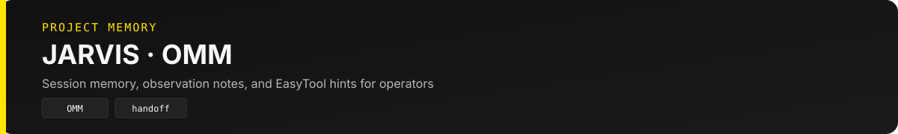

  

# JARVIS.md — Hermes Content Studio 프로젝트 메모리

> Cursor · Codex · JARVIS CODE · Hermes Agent 공유 컨텍스트 (JLC/JARVIS CODE 패턴 차용)

## NOW

- **in_progress:** playbook-loop promote 수동 · ask 품질 baseline 판정
- **last_stamp:** 2026-07-26
- **active_feature:** playbook-loop (F1–F3 passing)
- **arch:** System Logic **v2.1** — `docs/architecture/SYSTEM-LOGIC.md`
- **runtime:** Hermes Agent **v0.18.2** · config v33

## LAW

- 결정적 파이프라인 우선 — `assemble-*.py` · `HERMES_ENHANCE=1`일 때만 LLM polish
- `validate-output.sh` 통과 전 완료 선언 금지
- Telegram 요청: Notion 100% 동기화 + Permalink 필수
- 콘텐츠 작업: `-t hermes-cli` only (MCP·브라우저 마스킹)
- Voice + Naturalness blocking ON · budget cap 초과는 WARN
- LEARNED는 `curate-playbook.sh`만 · STABLE은 사람만 편집
- /ask는 graph_first (롤백: `HERMES_ASK_GRAPH=0`)

## BAN

- M1~M5 전체 LLM 재생성
- Notion 동기화 없이 Telegram만 응답
- `~/.hermes/.env` · credentials 읽기/커밋
- 범위 밖 리팩토링 (코딩 핸드오ff 시 5줄 diff 원칙)
- LEARNED 직접 편집 · expected 없는 delta 승격

## MAP

| 경로 | 역할 |
|------|------|
| `scripts/run-pipeline.sh` | M1+M2+M2b 결정적 (~20–26s 실측 / SLA 60–70s) |
| `scripts/run-research-brief.sh` | M1 리서치 (+ trust/keyword) |
| `scripts/run-content-package.sh` | M2 blog·IG·LI |
| `scripts/run-newsletter.sh` | M2b 뉴스레터 |
| `scripts/archive-to-notion.sh` | M5 Notion |
| `scripts/wiki-graph.sh` | Wiki Graph 빌드 |
| `scripts/ask-eval.sh` | /ask 토큰 비교 |
| `scripts/cost-report.sh` | 토큰·비용 리포트 |
| `scripts/curate-playbook.sh` | LEARNED 승격 루프 |
| `scripts/run-cursor-handoff.sh` | Cursor 코딩 위임 |
| `content/wiki/` · `graph.db` | 누적 wiki + graph |
| `config/skill-index.yaml` | Level1 스킬 인덱스 |
| `docs/architecture/SYSTEM-LOGIC.md` | 시스템 로직 v2.1 |
| `.harness/session-handoff.md` | 세션 재개 |
| `.harness/omm.jsonl` | 실수 방어선 (OMM) |

## OMM (Operational Memory — 실수 → 방어선)

자동 기록: `.harness/omm.jsonl` · `lib/omm.py` · session-handoff에 반영

| 날짜 | 실수 | 방어선 |
|------|------|--------|
| 2026-07-05 | Notion OAuth 만료 → archive 실패 | `reauth-notion-mcp.sh` 선행 · cron OAuth watch |
| 2026-07-09 | 중복 slug → validate FAIL | `lib/channel_artifacts.py` supervised 전 `_stale/` 이동 |
| 2026-07-26 | sessions.json non-dict → eval 회귀 | `hermes_cost.py` 방어 · full retest PASS |

## RAW (증거 포인터)

- Harness SoT: `.harness/progress.md` · `config/harness.yaml` v1.3.0
- 아키텍처: `docs/architecture/archive/v2.1-graph-token-playbook.md`
- 품질: `config/content-quality.yaml` · `voice_blocking` · `naturalness_blocking`
- 커맨더: `config/telegram-routing.yaml` · `config/commander-easytool.yaml`
- F1–F4: `feature_list.json` token-budget-gates · wiki-graph-v1 · ask-graph-context · playbook-loop
