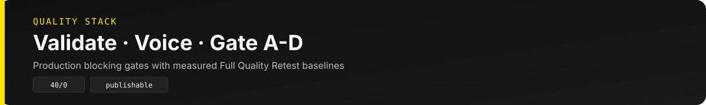

<p align="center">
  
</p>

# Hermes Content Studio

Apple Silicon Mac(MacBook Air M2)에서 돌아가는 **자체호스팅 마케팅·교육 콘텐츠 스튜디오**예요.  
두 가지 모드가 같은 품질 게이트를 공유해요.

- **일일 모드** — 리서치 브리프(`{date}_brief.md`)를 Brief SoT로 두고, 블로그·Threads·인스타그램·링크드인·B2B 뉴스레터를 **결정적 파이프라인(M1→M5)** 으로 생성·검증·Notion 아카이브해요.
- **토픽 모드 (Topic Pack M1–M6, 신규)** — 임의 키워드 하나로 리서치 → AX 자동화 설계 → 기술 자원 맵 → Future Ahead → 채널 초안 → 아카이브·학습까지 LLM 없이 10–20초에 만들어요.

[Harness v1.3](https://github.com/walkinglabs/awesome-harness-engineering) · System Logic [v2.1](docs/architecture/SYSTEM-LOGIC.md) · [`AGENTS.md`](AGENTS.md) · [`HARNESS.md`](HARNESS.md) · [Docs](docs/README.md)

---

## Proof

| 최신 기준선 (2026-10-02 · M2 이전 + Hermes Agent v0.21.5) | 값 |
|----------------------------------------------------------|-----|
| full_pipeline (`run-pipeline.sh`) | **16–29s** · `publishable=true` (SLA 60–70) |
| Topic Pack 라이브 E2E | 숏폼 커머스 8–13s · RAG 평가 9–19s · CDP 도입 13–17s — 7 게이트 PASS (SLA 90) |
| topic-pack-eval · pytest `tests/test_ax_*.py` | **21/0** · **44 passed** |
| harness-eval --quick | **39/1** (남은 1건: Hermes Gateway 미설치) |
| Newsletter Gate A–D · pipeline-integrity | **PASS** · **17/0** |
| init · health-check | **68/0** · **72/1** |

전체 품질 기준선(2026-08-12 Full Quality Retest): quick 40/0 · agents 40/0 · e2e 19/0 · ask-eval −81~88% tokens.

<p align="center">
  
</p>

---

## 한눈에 보기

| 할 수 있는 일 | 방식 |
|---|---|
| 주간 리서치 Top 7 | `run-research-brief.sh` (~15–21s) |
| 블로그 · Threads · IG · LinkedIn · 뉴스레터 | `run-pipeline.sh` (~16–29s 실측, LLM 불필요) |
| 임의 키워드 → AX Blueprint · Resource Map · Future Ahead · 채널 5종 | `run-topic-pack.sh "키워드"` (~10–20s) |
| Telegram / Slack / PlayMCP로 트리거 | Commander 라우팅 (`/pipeline` · `/topic`) |
| 품질·비용 통제 | `validate-output.sh` · voice/naturalness · **Newsletter Gate A–D** · Topic 7 게이트 · token_gate |
| 지식 누적 · `/ask` | Wiki Graph (`graph.db`) · graph_first |

<p align="center">
  
</p>

---

## 왜 이렇게 만들었나요

- **Brief SoT 한 장**이 모든 채널의 입력이에요. 채널마다 LLM으로 다시 쓰지 않아요.
- **결정적 스크립트 우선** — polish(`HERMES_ENHANCE=1`)는 선택이에요.
- **완료 = validate 통과 + `content/{channel}/` 저장** (+ Telegram이면 Notion Permalink).
- 뉴스레터는 **Gate A–D**로 신선도·CTA·publishable·CTOR 학습까지 막아요.
- 토픽 모드는 **relevance · coverage · diversity** 게이트를 통과한 근거만 AX 설계로 넘겨요.
- 커맨더는 Telegram · Slack · PlayMCP가 같은 파이프라인을 호출해요.

<p align="center">
  
</p>

---

## 빠른 시작

```bash
# 0) 의존성 (Hermes venv가 있으면 그쪽, 없으면 python3 폴백)
pip install -r ~/Hermes_Harness_dailybrief/requirements.txt

# 1) 세션 부트스트랩
~/Hermes_Harness_dailybrief/scripts/init.sh
cat ~/Hermes_Harness_dailybrief/.harness/progress.md

# 2) (선택) 서비스 — Ollama + Gateway
~/Hermes_Harness_dailybrief/scripts/start-services.sh
~/Hermes_Harness_dailybrief/scripts/health-check.sh

# 3) 리서치만 / 전체 파이프라인
~/Hermes_Harness_dailybrief/scripts/run-research-brief.sh
HERMES_WIKI_GRAPH=1 ~/Hermes_Harness_dailybrief/scripts/run-pipeline.sh

# 4) 뉴스레터 단독 + publishable 게이트
SKIP_INIT=1 ~/Hermes_Harness_dailybrief/scripts/run-newsletter.sh --validate

# 5) 토픽 모드 — 임의 키워드 하나로 Topic Pack
~/Hermes_Harness_dailybrief/scripts/run-topic-pack.sh "숏폼 커머스"
```

상태바가 필요하면:

```bash
~/Hermes_Harness_dailybrief/scripts/hermes-run.sh \
  "이번 주 리서치 브리프 작성" --skills marketing-research
```

---

## Topic Pack M1–M6 (토픽 모드)

일일 `{date}_brief.md` 파이프라인과 **병렬**로 도는 주제 모드예요. 키워드만 주면 아래 6단계를 결정적으로 실행해요.

| 단계 | 하는 일 | 산출물 (`content/topics/{slug}/`) | 게이트 |
|------|---------|-----------------------------------|--------|
| M1 Topic Research | 의도어 분리·약어 확장 → 7-Lens 쿼리 → ddgs web/news · GitHub · arXiv · HN → Evidence Pack | `topic_spec.json` · `*_evidence_*.json` · `*_research_*.md` | relevance ≥8 · coverage ≥4/7 렌즈 · diversity ≥2종·5도메인 |
| M2 AX Blueprint | 가치사슬 6단계 × 영향도/실행가능성 · 성숙도 L0–L4 · KPI/HITL/리스크 · 30/60/90 | `*_ax-blueprint_*.md/json` | 기회 ≥4 |
| M3 Resource Map | 도메인 도구 · 오픈소스 · 논문 · 학습 자원 | `*_resource-map_*.md/json` | validate |
| M4 Future Ahead | Now/Next/Future Horizons · 약한 신호 · 2×2 시나리오 · 월요일 액션 | `*_future-ahead_*.md/json` | 예측당 신호 ≥2 |
| M5 Channel Pack | blog · linkedin · newsletter · threads · instagram 초안 | `*_{channel}_*.md` | naturalness |
| M6 Archive & Learn | validate-output 5종 · memory delta(🆕) · 렌즈 피드백 · Notion `topic_pack` | `*_topic-pack_*.md` · `*_gates_*.json` · `_index.json` | validate |

```bash
# 전체 단계
~/Hermes_Harness_dailybrief/scripts/run-topic-pack.sh "숏폼 커머스"

# 일부 단계만 + JSON 요약
~/Hermes_Harness_dailybrief/scripts/run-topic-pack.sh "CDP 도입 방법" --stages M1,M2,M3,M4 --json

# M6에서 Notion 아카이브 (archive-to-notion --force)
~/Hermes_Harness_dailybrief/scripts/run-topic-pack.sh "RAG 평가" --notion

# 오프라인 fixture eval (네트워크 없이 결정적) · 라이브 키워드 eval
~/Hermes_Harness_dailybrief/scripts/topic-pack-eval.sh
~/Hermes_Harness_dailybrief/scripts/topic-pack-eval.sh --live "숏폼 커머스"
```

- **7-Lens:** 정의 · 시장/뉴스 · 기술/도구 · 사례 · 규제/리스크 · 한국 · 미래 신호
- **약어 가드:** CDP → customer data platform처럼 확장하고, 약어 단독 매칭은 마케팅 문맥이 있을 때만 인정해요 (기후 공시 CDP 같은 오탐 배제).
- **학습:** `memory.json`의 seen URL로 새 근거를 표시하고, 수율이 낮은 렌즈는 `.harness/topic-lens-feedback.json` 기준으로 다음 실행에서 쿼리를 늘려요.
- **설정 SoT:** [`config/topic-research.yaml`](config/topic-research.yaml) · 모듈: `scripts/lib/ax/` · 설계: [SYSTEM-LOGIC §5b](docs/architecture/SYSTEM-LOGIC.md)

---

## 주간 리듬

| 요일 | 산출 | 스크립트 |
|------|------|----------|
| 월 09:00 | 리서치 브리프 | `run-research-brief.sh` |
| 수 09:00 | 블로그 · Threads · IG · LinkedIn · 뉴스레터 | `run-pipeline.sh` / `run-newsletter.sh` |
| 금 09:00 | 강의 HTML · PPTX | `run-lecture-slides.sh` |
| 토 11:00 | L2 staging 점검 | `staging-supervised-eval.sh` (cron) |
| 요청 시 | Topic Pack | `run-topic-pack.sh "키워드"` · `/topic` |
| 요청 시 | Cursor 핸드오프 | `run-cursor-handoff.sh --latest` |

```bash
~/Hermes_Harness_dailybrief/scripts/setup-cron.sh
~/Hermes_Harness_dailybrief/scripts/setup-commander-cron.sh   # ~/.hermes/scripts 배포 (HERMES_WORKDIR 고정)
```

---

## 산출물 위치

```
content/
├── research/     # {date}_brief.md  ← Brief SoT
├── topics/       # {slug}/ Topic Pack (research · ax-blueprint · resource-map · future-ahead · 채널 5종 · topic-pack) + _index.json
├── blog/         # .html (Velog형 SEO/GEO 리포트)
├── instagram/    # .md + 이미지 프롬프트
├── linkedin/     # .md
├── newsletter/   # .md · .html · subject-scores.json · title-image
├── lectures/     # .md · .html · .pptx
├── wiki/         # 누적 개념 wiki (concepts · index · log)
└── packages/     # blog-article · threads · Notion paste · publish.json
```

파일명: `YYYY-MM-DD_{channel}_{slug}.{ext}` · 디자인: [`Getdesign.md`](Getdesign.md)

| 패키지 | 역할 |
|--------|------|
| `{date}_blog-article.md` | Velog형 일일 AI 트렌드 리포트 (Notion `blog`) |
| `{date}_threads.md` | Threads 숏폼 (Notion `threads`) |
| `{date}_newsletter-paste.md` | ESP 없이 Notion → 외부 붙여넣기 |
| `{date}_newsletter-publish.json` | `publishable` + Gate 실패 목록 |
| `topics/{slug}/{date}_topic-pack_{slug}.md` | Topic Pack 인덱스 (Notion `topic_pack`) |

---

## Commander 채널

| 채널 | 역할 | 셋업 |
|------|------|------|
| **Telegram** | `/pipeline` · `/topic` · 진행 메시지 · Notion Permalink | `setup-telegram.sh` · `setup-telegram-routing.sh` · `watch-telegram.sh` |
| **Slack** | `#일반데이터` `/pipeline` · `/topic` · 일일 digest | `setup-slack.sh` · `setup-slack-routing.sh` |
| **PlayMCP** | Kakao 커맨더 (Slack과 동일 명령) | `setup-playmcp.sh` |

토픽 모드 호출: `/topic <키워드>` · `/research <키워드> --pack` · 자연어 "토픽 리서치", "AX 설계"

```bash
# 결정적 트리거 (LLM 없음)
~/Hermes_Harness_dailybrief/scripts/telegram-pipeline.sh pipeline
```

---

## 품질 · 비용 · 지식

<p align="center">
  
</p>

### 프로덕션 게이트

- `voice_blocking` + `naturalness_blocking` ON · budget cap 초과는 WARN (`daily_token_cap: 600000`)
- 뉴스레터 **Gate A–D** (신선도/안전/제목 · Email/LI/CTA/이미지 · validate/publishable · CTOR 학습)
- Topic Pack **7 게이트** (relevance · coverage · diversity · blueprint · future · channel · validate)
- stale 제목 폴백(`2026 AI·마케팅 실무 인사이트` 등) · hero near-dup 차단

```bash
# 채널 validate
~/Hermes_Harness_dailybrief/scripts/validate-output.sh research content/research/$(date +%Y-%m-%d)_brief.md

# Voice · Naturalness
~/Hermes_Harness_dailybrief/scripts/voice-style-eval.sh
~/Hermes_Harness_dailybrief/scripts/naturalness-eval.sh

# Newsletter Gate A–D
~/Hermes_Harness_dailybrief/scripts/newsletter-freshness-eval.sh   # A
~/Hermes_Harness_dailybrief/scripts/newsletter-gate-b-eval.sh      # B
~/Hermes_Harness_dailybrief/scripts/newsletter-gate-c-eval.sh      # C
~/Hermes_Harness_dailybrief/scripts/newsletter-gate-d-eval.sh      # D

# Topic Pack
~/Hermes_Harness_dailybrief/scripts/topic-pack-eval.sh
python3 -m pytest tests/test_ax_*.py -q

# 비용 · Wiki · Ask
~/Hermes_Harness_dailybrief/scripts/cost-report.sh --since 7d
HERMES_WIKI_GRAPH=1 ~/Hermes_Harness_dailybrief/scripts/wiki-graph.sh
~/Hermes_Harness_dailybrief/scripts/ask-eval.sh --compare
```

### 전체 품질 스모크

```bash
~/Hermes_Harness_dailybrief/scripts/harness-eval.sh --quick      # 구조
~/Hermes_Harness_dailybrief/scripts/harness-eval.sh --record     # SLA 벤치
~/Hermes_Harness_dailybrief/scripts/e2e-smoke-test.sh            # E2E
~/Hermes_Harness_dailybrief/scripts/agents-eval.sh               # Agents A–D
~/Hermes_Harness_dailybrief/scripts/staging-supervised-eval.sh   # L2 staging
```

로컬 SoT는 `.harness/progress.md`예요. 리포트 예: `content/logs/2026-08-12_full-quality-retest.md` (gitignore)

---

## Harness

5-Subsystem ([awesome-harness-engineering](https://github.com/walkinglabs/awesome-harness-engineering)):

| 서브시스템 | SoT |
|-----------|-----|
| Instructions | `AGENTS.md` · `HARNESS.md` |
| State | `.harness/feature_list.json` · `progress.md` |
| Verification | `init.sh` · `harness-eval.sh` · Gate A–D evals · `topic-pack-eval.sh` |
| Scope | feature_list 단일 활성 기능 |
| Lifecycle | `session-handoff.md` |

```bash
~/Hermes_Harness_dailybrief/scripts/harness-eval.sh --quick
```

아키텍처 상세: [`docs/architecture/`](docs/architecture/)

---

## 디렉토리

```
Hermes_Harness_dailybrief/
├── AGENTS.md · HARNESS.md · Getdesign.md · JARVIS.md
├── assets/readme/ · assets/docs/   # README · Docs 비주얼 (Pure SVG)
├── config/                         # harness · newsletter · notion-archive · topic-research · *-routing
├── content/                        # 채널 산출물 (topics/ 포함)
├── docs/                           # Docs 허브 · architecture · plans
├── schemas/
├── scripts/                        # 파이프라인 · eval · commander
│   └── lib/ax/                     # Topic Pack 모듈 (topic_spec · evidence · blueprint · future …)
├── skills/
├── templates/
└── tests/                          # pytest (test_ax_*) · fixtures/topic
```

---

## Apple Silicon (M2) 메모

- 호스트: MacBook Air M2 (arm64, 16GB) · 워크스페이스 `~/Hermes_Harness_dailybrief`
- 스크립트는 자기 위치로 루트를 찾으므로 다른 경로(공백 포함)로 옮겨도 동작해요. `HERMES_WORKDIR`로 오버라이드할 수 있어요.
- Hermes Agent **v0.21.5** (런처 `~/.local/bin/hermes`) · 스튜디오 venv `~/.hermes/hermes-agent/venv` (Python 3.14, Hermes editable + `requirements.txt`)
- venv가 없으면 `python3`(pyenv 3.11)로 폴백하고, Hermes 의존 항목은 health-check에서 WARN으로 내려가요.
- 결정적 경로: `run-research-brief.sh` + `run-content-package.sh` + `run-newsletter.sh` + `run-topic-pack.sh`
- 로컬 polish: Ollama `gemma4:latest` (선택, Metal 가속)
- Homebrew: `/opt/homebrew` (arm64)
- 16GB 통합 메모리라 Ollama 대형 모델(llama3.3 등)과 Gateway를 동시에 띄우는 건 피하세요.
- MacBook Air는 팬리스라 장시간 LLM polish 시 스로틀링될 수 있어요. 상시 cron이면 전원 연결 + 절전 해제를 권장해요.

### 아직 환경 셋업이 필요한 항목

코드 회귀가 아니라 자격증명·설치 의존이에요. 아래를 마치면 남은 eval FAIL이 풀려요.

| 항목 | 명령 |
|------|------|
| Hermes Gateway | `hermes gateway install` |
| Notion MCP OAuth | `hermes mcp install notion` → `reauth-notion-mcp.sh` |
| Telegram / Slack 토큰 | `setup-telegram.sh` · `setup-slack.sh` |
| cron 스크립트 배포 | `setup-commander-cron.sh` |
| 형제 스튜디오 | `bootstrap-hermes-studios.py` |

---

## Cursor 연동

```bash
~/Hermes_Harness_dailybrief/scripts/install-cursor-cli.sh
~/Hermes_Harness_dailybrief/scripts/run-cursor-handoff.sh --latest
```

Telegram `/automate` → Codex HANDOFF → Cursor CLI (`HERMES_CURSOR_AUTO=1`).

---

## 선택 설정

| 항목 | 스크립트 / 비고 |
|------|-----------------|
| Codex | `setup-codex.sh` — claude-design · `HERMES_ENHANCE` |
| OpenRouter 등 | `~/.hermes/.env` (커밋 금지) |
| Notion REST | `NOTION_API_KEY` · `archive-to-notion.sh` |
| Notion/Slack MCP | Cursor MCP OAuth · `hermes mcp test notion` |

---

## 문서

- [`docs/README.md`](docs/README.md) — Docs 허브
- [`docs/architecture/SYSTEM-LOGIC.md`](docs/architecture/SYSTEM-LOGIC.md) — 현행 SoT (v2.1 · §5b Topic Pack)
- [`docs/plans/2026-10-02-001-feat-topic-agnostic-ax-m1-m6-plan.md`](docs/plans/2026-10-02-001-feat-topic-agnostic-ax-m1-m6-plan.md) — Topic Pack M1–M6 계획
- [`docs/LLM-WIKI-INTEGRATION.md`](docs/LLM-WIKI-INTEGRATION.md) — LLM Wiki 부분 통합 전략
- [`docs/superpowers/specs/2026-08-11-ai-agent-blog-threads-daily-report-design.md`](docs/superpowers/specs/2026-08-11-ai-agent-blog-threads-daily-report-design.md) — Velog형 블로그 + Threads 설계
- [`docs/superpowers/plans/2026-08-11-ai-agent-blog-threads-daily-report.md`](docs/superpowers/plans/2026-08-11-ai-agent-blog-threads-daily-report.md) — 구현 계획
- [`HARNESS.md`](HARNESS.md) · [`AGENTS.md`](AGENTS.md) · [`JARVIS.md`](JARVIS.md) · [`Getdesign.md`](Getdesign.md)

---

<p align="center">
  
</p>

README · Docs 비주얼은 [beautify-github-readme](https://github.com/oil-oil/beautify-github-readme) 방법론(Pure SVG · Value → Proof → First use)을 따라요.  
스킬 설치: `npx skills add oil-oil/beautify-github-readme`
