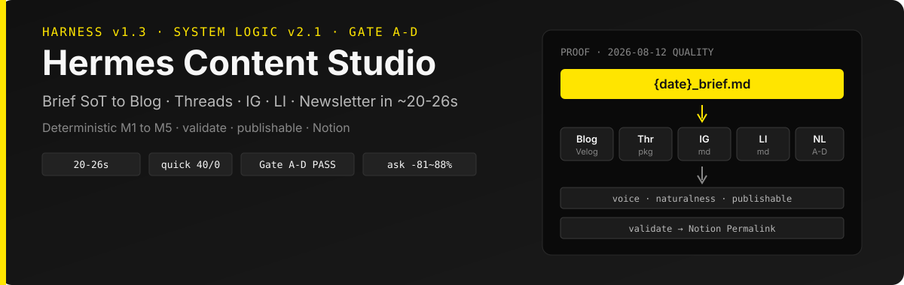
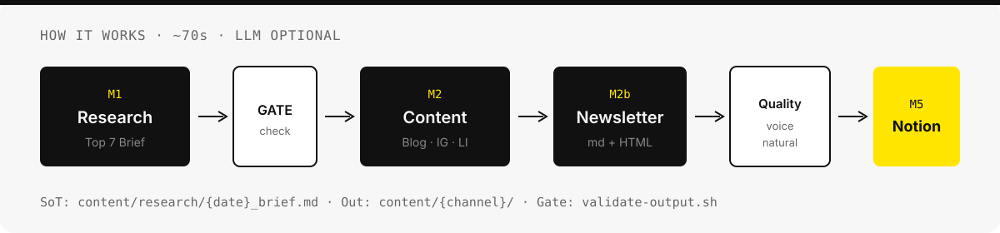

<p align="center">
  
</p>

# Hermes Content Studio

Intel Mac에서 돌아가는 **자체호스팅 마케팅·교육 콘텐츠 스튜디오**예요.  
일일 리서치 브리프(`{date}_brief.md`)를 Brief SoT로 두고, 블로그·인스타그램·링크드인·B2B 뉴스레터를 **결정적 파이프라인(M1→M5)** 으로 생성·검증·Notion 아카이브합니다.

[Harness v1.3](https://github.com/walkinglabs/awesome-harness-engineering) · System Logic [v2.1](docs/architecture/SYSTEM-LOGIC.md) · [`AGENTS.md`](AGENTS.md) · [`HARNESS.md`](HARNESS.md)

---

## 한눈에 보기

| 할 수 있는 일 | 방식 |
|---|---|
| 주간 리서치 Top 7 | `run-research-brief.sh` (~15s) |
| 블로그 · IG · LinkedIn · 뉴스레터 | `run-pipeline.sh` (~70s, LLM 불필요) |
| Telegram / Slack / PlayMCP로 트리거 | Commander 라우팅 |
| 품질·비용 통제 | `validate-output.sh` · voice/naturalness · token_gate |
| 지식 누적 · `/ask` | Wiki Graph (`graph.db`) · graph_first |

<p align="center">
  
</p>

---

## 왜 이렇게 만들었나요

- **Brief SoT 한 장**이 모든 채널의 입력이에요. 채널마다 LLM으로 다시 쓰지 않습니다.
- **결정적 스크립트 우선** — polish(`HERMES_ENHANCE=1`)는 선택입니다.
- **완료 = validate 통과 + `content/{channel}/` 저장** (+ Telegram이면 Notion Permalink).
- 커맨더는 Telegram · Slack · PlayMCP가 같은 파이프라인을 호출합니다.

---

## 빠른 시작

```bash
# 1) 세션 부트스트랩
~/hermes-content-studio/scripts/init.sh
cat ~/hermes-content-studio/.harness/progress.md

# 2) (선택) 서비스 — Ollama + Gateway
~/hermes-content-studio/scripts/start-services.sh
~/hermes-content-studio/scripts/health-check.sh

# 3) 리서치만 / 전체 파이프라인
~/hermes-content-studio/scripts/run-research-brief.sh
~/hermes-content-studio/scripts/run-pipeline.sh
```

상태바가 필요하면:

```bash
~/hermes-content-studio/scripts/hermes-run.sh \
  "이번 주 리서치 브리프 작성" --skills marketing-research
```

---

## 주간 리듬

| 요일 | 산출 | 스크립트 |
|------|------|----------|
| 월 09:00 | 리서치 브리프 | `run-research-brief.sh` |
| 수 09:00 | 블로그 · IG · LinkedIn · 뉴스레터 | `run-pipeline.sh` / `run-newsletter.sh` |
| 금 09:00 | 강의 HTML · PPTX | `run-lecture-slides.sh` |
| 요청 시 | Cursor 핸드오프 | `run-cursor-handoff.sh --latest` |

```bash
~/hermes-content-studio/scripts/setup-cron.sh
```

---

## 산출물 위치

```
content/
├── research/     # {date}_brief.md  ← Brief SoT
├── blog/         # .html (SEO/AEO)
├── instagram/    # .md + 이미지 프롬프트
├── linkedin/     # .md
├── newsletter/   # .md · .html · subject-scores.json
├── lectures/     # .md · .html · .pptx
└── packages/     # Notion paste · publish 메타
```

파일명: `YYYY-MM-DD_{channel}_{slug}.{ext}` · 디자인: [`Getdesign.md`](Getdesign.md)

---

## Commander 채널

| 채널 | 역할 | 셋업 |
|------|------|------|
| **Telegram** | `/pipeline` · 진행 메시지 · Notion Permalink | `setup-telegram.sh` · `setup-telegram-routing.sh` · `watch-telegram.sh` |
| **Slack** | `#일반데이터` `/pipeline` · 일일 digest | `setup-slack.sh` · `setup-slack-routing.sh` |
| **PlayMCP** | Kakao 커맨더 (Slack과 동일 명령) | `setup-playmcp.sh` |

```bash
# 결정적 트리거 (LLM 없음)
~/hermes-content-studio/scripts/telegram-pipeline.sh pipeline
```

---

## 품질 · 비용 · 지식

```bash
~/hermes-content-studio/scripts/validate-output.sh
~/hermes-content-studio/scripts/voice-style-eval.sh
~/hermes-content-studio/scripts/naturalness-eval.sh
~/hermes-content-studio/scripts/cost-report.sh --since 7d
HERMES_WIKI_GRAPH=1 ~/hermes-content-studio/scripts/wiki-graph.sh
```

프로덕션 게이트: `voice_blocking` + `naturalness_blocking` ON · budget cap 초과는 WARN.

---

## Harness

5-Subsystem ([awesome-harness-engineering](https://github.com/walkinglabs/awesome-harness-engineering)):

| 서브시스템 | SoT |
|-----------|-----|
| Instructions | `AGENTS.md` · `HARNESS.md` |
| State | `.harness/feature_list.json` · `progress.md` |
| Verification | `init.sh` · `harness-eval.sh` |
| Scope | feature_list 단일 활성 기능 |
| Lifecycle | `session-handoff.md` |

```bash
~/hermes-content-studio/scripts/harness-eval.sh --quick
```

아키텍처 상세: [`docs/architecture/`](docs/architecture/)

---

## 디렉토리

```
hermes-content-studio/
├── AGENTS.md · HARNESS.md · Getdesign.md
├── assets/readme/          # README 비주얼
├── config/                 # harness · orchestration · channels
├── content/                # 채널 산출물
├── docs/architecture/      # System Logic SoT
├── schemas/                # handoff · graph 등
├── scripts/                # 결정적 파이프라인 · eval · commander
├── skills/                 # Hermes 스킬
└── templates/
```

---

## Intel Mac 메모

- 결정적 경로: `run-research-brief.sh` + `run-content-package.sh` + `run-newsletter.sh`
- 로컬 polish: Ollama `gemma4:latest` (선택)
- 16GB 이하에서는 Ollama + Gateway 동시 실행에 주의
- 상시 cron이면 Mac 절전 해제 권장

---

## Cursor 연동

```bash
~/hermes-content-studio/scripts/install-cursor-cli.sh
~/hermes-content-studio/scripts/run-cursor-handoff.sh --latest
```

Telegram `/automate` → Codex HANDOFF → Cursor CLI (`HERMES_CURSOR_AUTO=1`).

---

## 선택 설정

| 항목 | 스크립트 / 비고 |
|------|-----------------|
| Codex | `setup-codex.sh` — claude-design · `HERMES_ENHANCE` |
| OpenRouter 등 | `~/.hermes/.env` (커밋 금지) |
| Notion REST | `NOTION_API_KEY` · `archive-to-notion.sh` |
| Notion/Slack MCP | Cursor MCP OAuth · `hermes mcp test notion` |

---

## 문서

- [`docs/README.md`](docs/README.md) — Docs 허브 (배너·타임라인)
- [`docs/architecture/SYSTEM-LOGIC.md`](docs/architecture/SYSTEM-LOGIC.md) — 현행 SoT (v2.1)
- [`HARNESS.md`](HARNESS.md) — 하네스 스펙
- [`AGENTS.md`](AGENTS.md) — 에이전트 실행 컨텍스트
- [`JARVIS.md`](JARVIS.md) — 프로젝트 메모리
