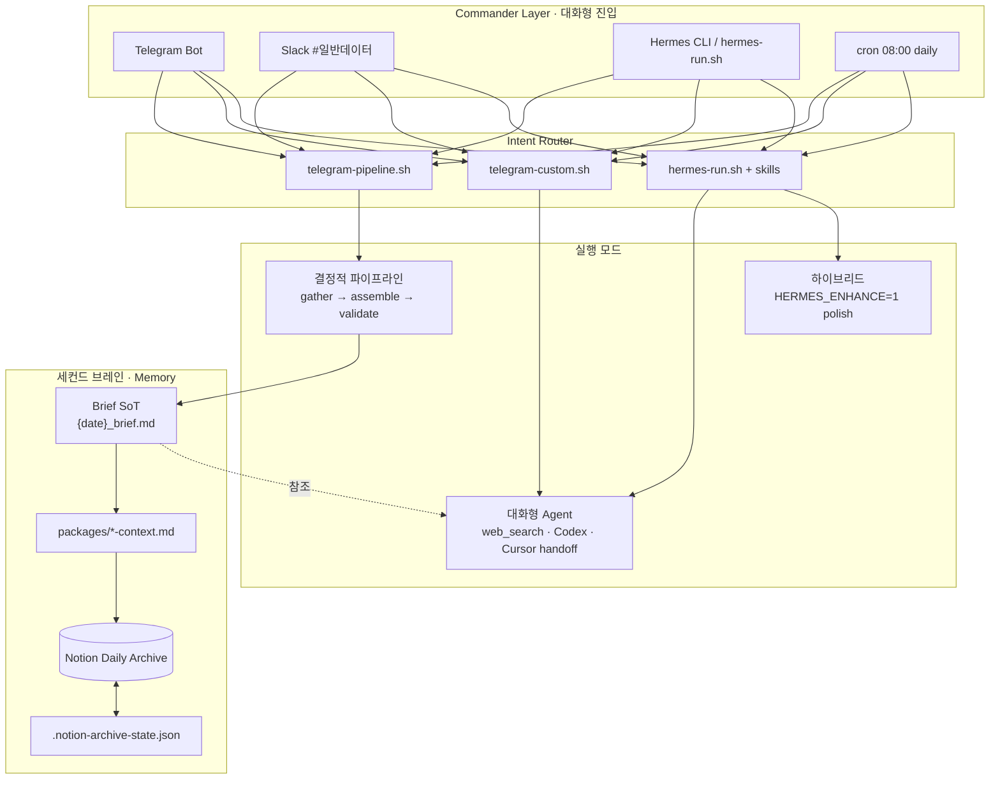
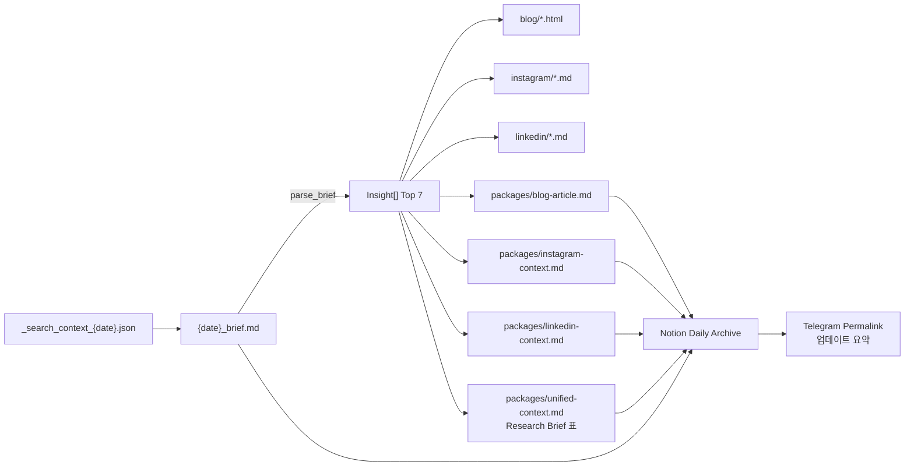
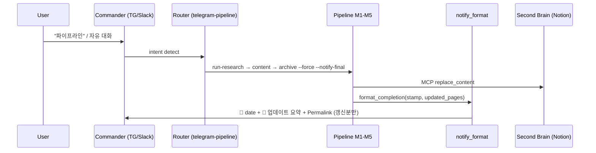
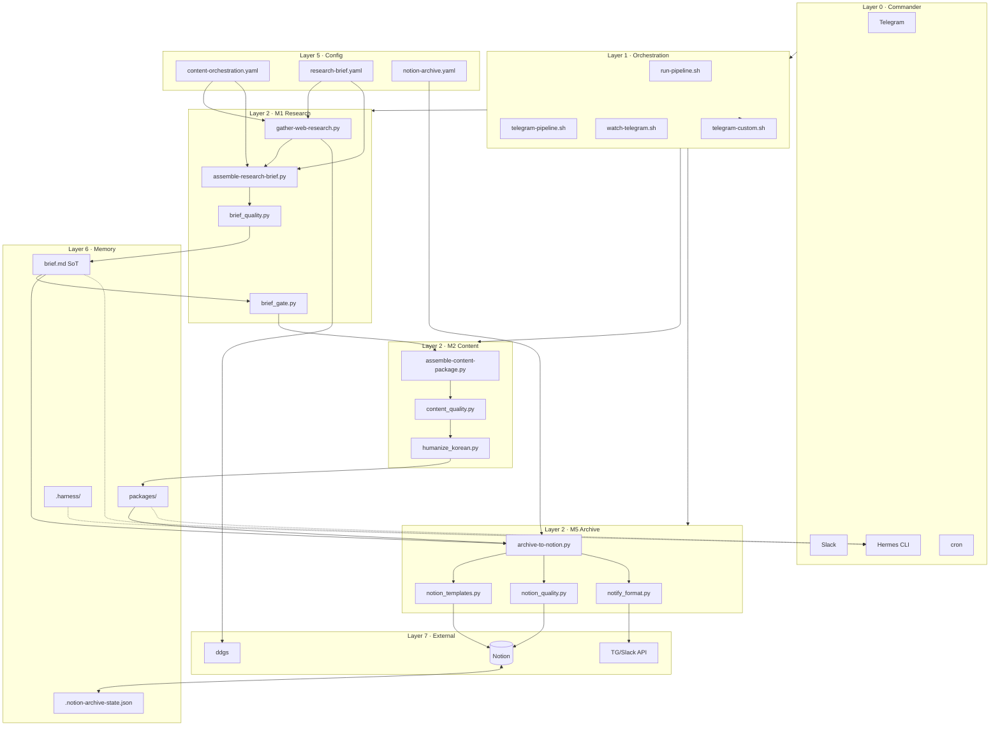

# Hermes Conversational Agent Model

> Hermes Content Studio — **대화형 Agent**(리서치 · 세컨드 브레인 · 개인 업무) + **결정적 콘텐츠 파이프라인** 통합 모델  
> Harness v1.2 · Studio v1.3 · Brief SoT Top 7 · Notion Archive

---

## 0. Agent 모델 한 줄 정의

**Hermes 대화형 Agent**는 Telegram·Slack·Hermes CLI를 **커맨더(Commander)** 로 두고, 사용자 의도를 **결정적 파이프라인(M1→M5)** 또는 **대화형 작업(리서치·메일·핸드오프)** 으로 라우팅한다. 모든 산출물은 `content/`에 쌓이고, **Notion**이 세컨드 브레인 아카이브, **Brief SoT**가 지식의 단일 출처(Single Source of Truth)가 된다.



---

## 1. 이중 런타임: 결정적 vs 대화형

| 축 | 결정적 파이프라인 | 대화형 Hermes Agent |
|----|------------------|---------------------|
| **목적** | 일일 콘텐츠·Notion 아카이브 재현 | 리서치 심화·개인 업무·세컨드 브레인 질의 |
| **진입** | `run-pipeline.sh`, `telegram-pipeline.sh pipeline` | `hermes-run.sh`, Telegram 자유 텍스트, `telegram-custom.sh` |
| **도구** | `hermes-cli` only (tool masking) | skills + MCP(Notion·Slack) + Codex(선택) |
| **시간** | ~25–45s (M1+M2+M5) | 가변 (대화 턴·파일럿) |
| **산출물** | `content/{channel}/`, `packages/` | + `content/personal/`, `drafts/cursor-handoff/` |
| **검증** | `validate-output.sh` 필수 | harness 가드레일 + 수동 확인 |
| **Notion** | M5 force sync + Permalink | archive-to-notion on demand |

**통합 원칙:** 대화형 Agent가 트리거해도 **M1→M2→M5는 동일 스크립트·동일 lib**을 탄다. LLM은 `HERMES_ENHANCE=1` 또는 개인화 경로에서만 개입한다.

---

## 2. CAR + 5-Subsystem (Harness 확장)

[awesome-harness-engineering](https://github.com/walkinglabs/awesome-harness-engineering) CAR를 Hermes Agent에 매핑한다.

| CAR | Harness 서브시스템 | Agent 역할 | 핵심 아티팩트 |
|-----|-------------------|-----------|--------------|
| **Control** | Instructions | 대화·파이프라인 규칙, 완료 정의 | `AGENTS.md`, `HARNESS.md`, `config/harness.yaml` |
| **Control** | Scope | 단일 활성 기능·채널 | `.harness/feature_list.json` |
| **Control** | Verification | 완료 전 게이트 | `validate-output.sh`, `brief_gate.py` |
| **Agency** | Deterministic | LLM 없이 assemble | `gather-*.py`, `assemble-*.py`, `content_quality.py` |
| **Agency** | Tool masking | 콘텐츠 작업 시 MCP 제외 | `-t hermes-cli`, `config/harness.yaml` |
| **Agency** | Context backpressure | 사전 검색·파일 메모리 | `_search_context_{date}.json`, Brief SoT |
| **Runtime** | Bootstrap | 세션 시작 | `init.sh`, `health-check.sh` |
| **Runtime** | Observability | 트레이스·비용 | `.harness/traces/`, `cost-ledger.jsonl` |
| **Runtime** | Lifecycle | 핸드오프 | `.harness/progress.md`, `session-handoff.md` |
| **Runtime** | Commander | 대화형 진입·알림 | `watch-telegram.sh`, `notify_format.py` |

---

## 3. 파이프라인 단계 (M1 → M5) · 운영 리소스 계층

### 3.1 Stage Map

| Stage | 이름 | 스크립트 | 산출물 (SoT) | Skill |
|-------|------|---------|-------------|-------|
| **M1** | Research | `run-research-brief.sh` | `{date}_brief.md`, `_search_context_{date}.json` | `channels/research`, `marketing-research` |
| **M2** | Content | `run-content-package.sh` | blog · instagram · linkedin · `packages/*` | `content-orchestration` |
| **M3** | Optimize | `HERMES_ENHANCE=1` | polish (선택) | channel skills |
| **M4** | Analytics | simulation | — | `harness-ops` |
| **M5** | Archive | `archive-to-notion.sh` | Notion 5 pages + Permalink | `notion-archive`, `telegram-commander` |

설정 SoT: `config/content-orchestration.yaml`

### 3.2 리소스 계층 (Layer 0 → 7)

```
Layer 0  Commander      Telegram · Slack · Hermes CLI · cron
Layer 1  Orchestration  run-pipeline.sh · telegram-pipeline.sh · watch-telegram.sh
Layer 2  Stage Scripts  run-research-brief.sh · run-content-package.sh · archive-to-notion.sh
Layer 3  Assemble       gather-web-research.py · assemble-research-brief.py · assemble-content-package.py
Layer 4  Domain lib     brief_* · content_quality · notion_* · notify_format · humanize_korean
Layer 5  Config         config/*.yaml (studio · orchestration · research-brief · notion-archive · …)
Layer 6  Harness State  .harness/* · content/.notion-archive-state.json
Layer 7  External       Notion MCP · Telegram/Slack API · ddgs · Gemini Image · Ollama/Codex
```

### 3.3 Layer 2 — Stage Scripts (의존 관계)

| 스크립트 | 호출 | 검증 |
|---------|------|------|
| `init.sh` | 세션 시작 | `health-check.sh` |
| `run-research-brief.sh` | `gather-web-research.py` → `assemble-research-brief.py` | `validate-output.sh research` |
| `run-content-package.sh` | `brief_gate` → (선택 M1) → `assemble-content-package.py` | blog · instagram · linkedin · packages |
| `run-pipeline.sh` | M1 → M2(`HERMES_SKIP_RESEARCH=1`) → M5(`--force --notify-final`) | `harness-eval.sh` |
| `archive-to-notion.sh` | `archive-to-notion.py` | Notion MCP + `notion_quality.py` |
| `telegram-pipeline.sh` | M1 · M2 · M5 + `notify_format` | Permalink 필수 |
| `telegram-custom.sh` | mail · automate · Codex | `personal-assistant` skill |
| `watch-telegram.sh` | log tail → `telegram-post-sync.sh` | debounce · instance lock |
| `slack-daily-log.sh` | digest · `--summary-only` | `#일반데이터` |

### 3.4 Layer 3 — Assemble (결정적 코어)

| 모듈 | 입력 | 출력 | 의존 lib |
|------|------|------|---------|
| `gather-web-research.py` | `config/research-brief.yaml` | `_search_context_{date}.json` | ddgs |
| `assemble-research-brief.py` | search json | `{date}_brief.md` Top 7 | `brief_quality.py` |
| `assemble-content-package.py` | brief md | channel files + packages | `content_quality.py`, `brief_gate.py` |

### 3.5 Layer 4 — Domain Library (의존성 라이브러리 맵)

파이프라인 **의존성 라이브러리** — 스크립트가 import하는 Python 모듈과 역할.

#### M1 · Research

| lib | 역할 | 의존 |
|-----|------|------|
| `brief_quality.py` | 1인칭 톤 · pick · URL 필터 · SCQA | `common.py` |
| `brief_gate.py` | M2 전 Top 7 · 신선도 게이트 | brief file, search json |
| `common.py` | slugify, truncate, studio_today | — |

#### M2 · Content

| lib | 역할 | 의존 |
|-----|------|------|
| `content_quality.py` | blog HTML · IG/LI MD · packages · Gemini 프롬pt · unified 표 | `humanize_korean.py`, templates |
| `humanize_korean.py` | 해요체 · im-not-ai 톤 | `config/voice-style.yaml` |

**content_quality.py 내부 그래프:**

```
parse_brief(brief.md) → Insight[]
  ├─ build_blog_html / build_blog_article_md
  ├─ build_instagram_md / build_instagram_context_md
  │    └─ instagram_carousel_spec → append_instagram_gemini_prompts
  ├─ build_linkedin_md / build_linkedin_context_md
  │    └─ build_linkedin_post_text + build_linkedin_image_prompt
  └─ build_unified_context_md
       └─ build_brief_excerpt_table (Notion 표)
```

#### M5 · Notion · Notify

| lib | 역할 | 의존 |
|-----|------|------|
| `notion_client.py` | MCP OAuth · create/update page | `~/.hermes/config.yaml` |
| `markdown_notion.py` | MD/HTML → Notion MD | `notion_templates.py` |
| `notion_templates.py` | callout 메타 · blog ## 정규화 | — |
| `notion_quality.py` | score · canonical/draft | `config/notion-archive.yaml` |
| `notion_hygiene.py` | 중복 → Draft Archive | state json |
| `notify_format.py` | progress · 업데이트 요약 · Permalink 필터 | — |
| `telegram_notify.py` | Telegram API | `notify_format.py` |
| `slack_notify.py` | Slack API | `notify_format.py` |

#### Harness · Shared

| lib | 역할 |
|-----|------|
| `harness.py` | trace append · SLA regression |
| `studio-date.sh` | `Asia/Seoul` 날짜 SoT |

### 3.6 Layer 5 — Config

| 파일 | 소비자 |
|------|--------|
| `config/studio.yaml` | 전체 스튜디오 · cron · integrations |
| `config/content-orchestration.yaml` | M1–M5 · pipelines · skill_layers |
| `config/research-brief.yaml` | gather · assemble brief |
| `config/harness.yaml` | SLA · guardrails · verification |
| `config/notion-archive.yaml` | archive categories · hygiene |
| `config/content-guidelines.yaml` | SEO/AEO/GEO |
| `config/voice-style.yaml` | humanize · 마케터 페르소나 |
| `config/telegram-routing.yaml` | Telegram commander |
| `config/slack-routing.yaml` | Slack home channel |
| `config/personal-tasks.yaml` | mail · automate |
| `config/lecture-design.yaml` | 강의 (M2 외) |

### 3.7 Layer 6 — State · Memory (세컨드 브레인)

| 경로 | 역할 |
|------|------|
| `content/research/{date}_brief.md` | **Brief SoT** — M2·대화형 Agent 공통 참조 |
| `content/research/_search_context_{date}.json` | 원시 검색 (web_search 생략) |
| `content/packages/*` | Notion 아카이브 입력 · 통합 컨텍스트 |
| `content/.notion-archive-state.json` | hash · Permalink · tier |
| `.harness/progress.md` | 세션 진행 |
| `.harness/feature_list.json` | 검증 범위 |
| `.harness/traces/` | 성능 trace |
| `content/personal/` | 메일 digest · ask · automate |
| `content/drafts/cursor-handoff/` | Cursor Agent 핸드오프 |

### 3.8 Layer 7 — External · Runtime

| 서비스 | 용도 | 설정 |
|--------|------|------|
| Notion MCP | M5 archive | OAuth · `notion-archive.yaml` |
| Telegram Bot | Commander · Permalink | `TELEGRAM_*` |
| Slack Bot | digest · 알림 | `SLACK_*` · C0B8CN2EA05 |
| ddgs | M1 gather | `gather-web-research.py` |
| Gemini Image | IG 4:5 · LI 2×2 프롬pt | packages 내 명세 |
| Hermes Gateway | 대화형 Agent | `~/.hermes/` |
| Ollama | 로컬 요약 (선택) | `:11434` |
| Codex | polish · personal | `HERMES_ENHANCE`, `telegram-custom.sh` |
| PlayMCP | Kakao commander | `setup-playmcp.sh` |

---

## 4. Skills 계층 (Agent Capability Map)

대화형 Hermes Agent의 **스킬 = Capability**. 파이프라인 stage와 1:1 또는 N:1 매핑.

| 우선 | Skill | Agent 모드 | Pipeline |
|------|-------|-----------|----------|
| 0 | `harness-ops` | 상태·eval | init · harness-eval |
| 1 | `content-orchestration` / `content-pipeline` | "주간 패키지" | M2 orchestration |
| 2 | `telegram-commander` | Telegram 요청 | M1+M2+M5 + notify |
| 3 | `marketing-research` / `channels/research` | "리서치해줘" | M1 |
| 4 | `channels/blog`, `instagram`, `linkedin` | 채널 스펙 | M2 |
| 5 | `notion-archive` | "노션 동기화" | M5 |
| 6 | `content-studio-slides` | `/lecture` | lecture pipeline |
| 7 | `playmcp-commander` | Kakao | 동일 commander |
| — | `personal-assistant` | mail · automate | `telegram-custom.sh` |
| — | `vibe-coding-cursor` | 구현 핸드오프 | `run-cursor-handoff.sh` |
| shared | `validate`, `humanize-korean`, `handoff` | 횡단 | lib |

Skill 파일: `skills/**/SKILL.md` · 프롬pt: `skills/prompts/`

---

## 5. 데이터 SoT 체인 (의존성 흐름)



**파일명 규칙:** `YYYY-MM-DD_{channel}_{slug}.{ext}` · 디자인: `Getdesign.md`

---

## 6. Notion 세컨드 브레인 구조

```
Daily Archive ({date})
├── 🔗 Unified Context      ← Executive Context + Top 7 + Research Brief 표
├── 📋 Research Brief       ← Top 7 · Executive Summary
├── 📝 Blog
├── 📸 Instagram Context    ← Gemini 3장 프롬pt
├── 💼 LinkedIn Context     ← 2×2 웹툰 프롬pt
└── 🗂️ Draft Archive        ← quality < 60
```

품질: `notion_quality.py` · 템플릿: `notion_templates.py` · 설정: `config/notion-archive.yaml`

---

## 7. Commander · 알림 모델



| 규칙 | 구현 |
|------|------|
| 최신 날짜만 | `📅 {stamp}` prefix · `pages_for_stamp()` |
| 업데이트 요약 | `format_update_summary()` · CATEGORY_BLURB |
| 중복 제거 | `--notify-final` · watch 4/5 → archive 5/5 1회 |
| Slack | `--summary-only` compact · 전문은 `content/logs/` |

---

## 8. 대화형 Agent 시나리오 (3축)

### 8.1 리서치 (Research)

| 사용자 의도 | 라우트 | 산출물 |
|------------|--------|--------|
| "이번 주 트렌드" | `telegram-pipeline research` | `{date}_brief.md` |
| "심층 분석" | `hermes-run.sh` + `marketing-research` | brief polish |
| cron 08:00 | `daily-research-brief` | 자동 M1 |

**Agent 컨텍스트:** `_search_context_{date}.md` 참조 → web_search 생략

### 8.2 세컨드 브레인 (Second Brain)

| 사용자 의도 | 라우트 | 산출물 |
|------------|--------|--------|
| "노션 동기화" | `archive-to-notion.sh --force` | 5 pages + Permalink |
| "오늘 콘텐츠 어디?" | Notion Daily URL | state json |
| 통합 컨텍스트 | `unified-context.md` | Brief 표 + 채널 요약 |

**Agent 컨텍스트:** Notion MCP · `packages/*` · Permalink in Telegram

### 8.3 개인 업무 (Personal)

| 사용자 의도 | 라우트 | 산출물 |
|------------|--------|--------|
| "받편함 요약" | `telegram-custom.sh mail` | `content/personal/*_mail-digest.md` |
| "자동화 구현" | `telegram-custom.sh` + Codex | `content/personal/*_automate_*.md` |
| Cursor 핸드오프 | `run-cursor-handoff.sh` | `drafts/cursor-handoff/*` |

설정: `config/personal-tasks.yaml` · skill: `personal-assistant`

---

## 9. 전체 의존성 다이어그램 (통합)



---

## 10. 환경 변수 · 분기 (Agent ↔ Pipeline)

| 변수 | 효과 | Agent 사용 |
|------|------|-----------|
| `HERMES_SKIP_RESEARCH=1` | M1 생략 | Brief SoT 재사용 |
| `HERMES_FORCE_RESEARCH=1` | M1 강제 | "최신으로 다시" |
| `HERMES_ENHANCE=1` | LLM polish | 대화형 품질 향상 |
| `SKIP_NOTION_ARCHIVE=1` | M5 생략 | 로컬만 |
| `--notify-final` | Telegram 5/5 1회 | Commander 알림 |
| `TELEGRAM_PROGRESS=0` | watch 진행 끔 | 조용한 sync |
| `STUDIO_TZ=Asia/Seoul` | 날짜 SoT | cron·archive 일치 |

---

## 11. Cron · 자동 Agent

| Job | Cron (KST) | Stage | Skill |
|-----|-----------|-------|-------|
| `daily-research-brief` | 08:00 매일 | M1 | `channels/research` |
| `weekly-content-package` | 수 09:00 | M1+M2 | `content-orchestration` |
| `weekly-lecture-planning` | 금 09:00 | lecture | `content-studio-slides` |

등록: `scripts/setup-cron.sh` · 설정: `config/studio.yaml`

---

## 12. 검증 · 완료 정의 (Definition of Done)

Agent·파이프라인 공통 DoD:

1. `scripts/validate-output.sh` 통과
2. 산출물 `content/{channel}/` 저장
3. Telegram 요청 시 `archive-to-notion.sh --force` + Permalink
4. `.harness/progress.md` 업데이트

```bash
# 세션 시작
~/hermes-content-studio/scripts/init.sh
cat ~/hermes-content-studio/.harness/progress.md

# 전체 파이프라인 (결정적)
~/hermes-content-studio/scripts/run-pipeline.sh

# Telegram 커맨더
~/hermes-content-studio/scripts/telegram-pipeline.sh pipeline

# Notion force + 최종 알림
~/hermes-content-studio/scripts/archive-to-notion.sh $(date +%Y-%m-%d) --force --notify-final
```

---

## 13. 문서 · 참조 인덱스

| 문서 | 역할 |
|------|------|
| **본 문서** | Agent 모델 + 리소스 계층 + lib 의존성 통합 |
| `AGENTS.md` | 에이전트 세션 규칙 |
| `HARNESS.md` | Harness CAR · SLA |
| `Getdesign.md` | 비주얼 · 강의 |
| `config/content-orchestration.yaml` | M1–M5 machine-readable |
| `skills/telegram-commander/SKILL.md` | Commander 프로토콜 |

---

*Last aligned: 2026-06-07 — Brief SoT Top 7 · Notion templates · notify-final · Unified Brief table*
