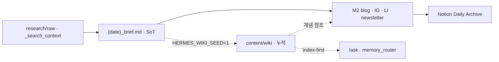

# LLM Wiki 통합 전략 — Hermes Content Studio

> [Karpathy LLM Wiki](https://gist.github.com/karpathy/442a6bf555914893e9891c11519de94f) 패턴을 **부분 반영**한 운영 SoT  
> Harness v1.2 · 결정적 파이프라인 우선 · 이중 메모리

---

## 결론 (한 줄)

**일별 콘텐츠 공장(M1→M5)은 그대로 두고**, Commander·장기 리서치·개인 메모를 위해 **누적 wiki 계층**을 선택적으로 쌓는다. 전면 Wiki 교체는 SLA·재현성·validate 게이트를 훼손하므로 하지 않는다.

---

## 이중 메모리 · 이중 런타임

| 계층 | 역할 | 런타임 | 갱신 주기 |
|------|------|--------|----------|
| **일별 SoT** | `{date}_brief.md` → M2 채널 | 결정적 (`assemble-*.py`) | 매일 08:00 |
| **누적 Wiki** | `content/wiki/` 개념·엔티티·합성 | Seed(결정적) + Ingest/Lint(LLM, 옵션) | M1 후 / 주간 / `/ask` 후 |



---

## 선택 (도입 · 강화)

| 영역 | 내용 | 진입점 |
|------|------|--------|
| Commander `/ask` | `memory_router`가 `wiki/index.md` → concepts 우선 조회 | `hermes-agent.sh ask` |
| Brief Graph 확장 | `topic_key` → `wiki/concepts/{key}.md` 결정적 Seed | `HERMES_WIKI_SEED=1` + `wiki-seed.sh` |
| Personal Bridge | 메일·메모 → `research/raw/` → LLM Ingest | `HERMES_WIKI_INGEST=1` + `run-wiki-ingest.sh` |
| Lint | 모순·고아·stale URL 주간 점검 | `HERMES_WIKI_LINT=1` + `run-wiki-lint.sh` |
| `/ask` 답변 아카이브 | 탐색 결과 → `wiki/output/` | `wiki-maintainer` skill Query 워크플로 |

**우선순위:** `/ask` index-first → Wiki Seed → 주간 Lint → LLM Ingest.

---

## 유지 (변경 금지)

| 항목 | 이유 |
|------|------|
| M1→M2→M2b→M5 결정적 파이프라인 (~70s) | Harness 핵심 가치·SLA |
| `{date}_brief.md` Brief SoT | M2·validate·Notion 공통 입력 |
| `validate-output.sh` 채널 게이트 | 품질·재현성 |
| Notion M5 + Telegram Permalink | 발행 아카이브 (wiki와 역할 분리) |
| `HERMES_ENHANCE=1` polish 경로 | 선택 LLM만 M3 |
| `gather-web-research.py` 일별 수집 | context backpressure |

Wiki Ingest를 **M1 SLA 경로에 직접 넣지 않는다.** 소스당 10~15 페이지 갱신은 비동기·옵션 전용.

---

## 신설

| 아티팩트 | 경로 | 역할 |
|----------|------|------|
| 통합 전략 (본 문서) | `docs/LLM-WIKI-INTEGRATION.md` | 선택·유지·신설 SoT |
| Wiki 설정 | `config/wiki.yaml` | 경로·env·memory_router |
| Wiki 스키마 skill | `skills/shared/wiki-maintainer/SKILL.md` | Ingest · Query · Lint |
| Wiki 루트 | `content/wiki/index.md` · `log.md` | index-first · 타임라인 |
| 개념·엔티티 | `content/wiki/concepts/` · `entities/` | topic_key 누적 |
| Query 아카이브 | `content/wiki/output/` | `/ask` 합성 보존 |
| 불변 raw | `content/research/raw/` | 클립·PDF (LLM Ingest 입력) |
| `lib/wiki_router.py` | index-first 검색 | memory_router 연동 |
| `lib/wiki_seed.py` | Brief Graph → concepts | 결정적 Seed |
| `wiki-seed.sh` | Seed 실행 | M1 후 옵션 |
| `run-wiki-ingest.sh` | LLM Ingest | `HERMES_WIKI_INGEST=1` |
| `run-wiki-lint.sh` | LLM Lint | `HERMES_WIKI_LINT=1` |
| `wiki-lint-eval.sh` | 구조 게이트 | harness-eval 보조 |
| feature `pipe-009` | `.harness/feature_list.json` | Wiki 계층 검증 범위 |

---

## 환경 변수

| 변수 | 기본 | 동작 |
|------|------|------|
| `HERMES_WIKI_SEED=1` | off | M1/Brief Graph → `wiki/concepts/` 결정적 갱신 |
| `HERMES_WIKI_INGEST=1` | off | `research/raw/` 신규 소스 LLM Ingest |
| `HERMES_WIKI_LINT=1` | off | 주간 wiki 건강검진 (모순·고아·stale) |

일일 `run-pipeline.sh` 기본 실행에는 **영향 없음**.

---

## Notion vs Wiki

| | Notion (M5) | Wiki |
|--|-------------|------|
| 목적 | 발행·공유·Permalink | 작업 중 합성·개념 그래프 |
| 갱신 | 일별 canonical replace | 누적·교차참조 |
| LLM | polish·아카이브 포맷 | Ingest·Lint·Query (옵션) |

---

## 검증

```bash
# 구조 게이트 (네트워크·LLM 불필요)
~/hermes-content-studio/scripts/wiki-lint-eval.sh

# 결정적 Seed (brief 있을 때)
HERMES_WIKI_SEED=1 ~/hermes-content-studio/scripts/wiki-seed.sh

# memory_router wiki 히트
~/hermes-content-studio/scripts/hermes-agent.sh ask "Claude AX 인사이트"
```

---

## 참고

- [LLM Wiki gist](https://gist.github.com/karpathy/442a6bf555914893e9891c11519de94f)
- `docs/HERMES-CONVERSATIONAL-AGENT-MODEL.md` §3.7 Layer 6
- `config/agent-commands.yaml` · `memory_router.source_order`
