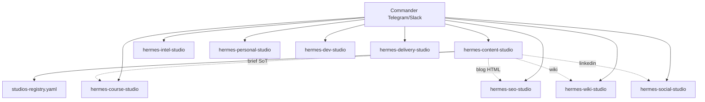

# Hermes Multi-Studio Architecture

> Parent: `hermes-content-studio` · Harness v2.0 · 8 sibling studios  
> 전체 시스템 로직: [architecture/SYSTEM-LOGIC.md](./architecture/SYSTEM-LOGIC.md)

## Studio 목록

| Tier | ID | 디렉터리 | 파이프라인 |
|------|-----|---------|-----------|
| 1 | course | `~/hermes-course-studio` | `run-course-pipeline.sh` |
| 1 | intel | `~/hermes-intel-studio` | `run-intel-pipeline.sh` |
| 1 | seo | `~/hermes-seo-studio` | `run-seo-pipeline.sh` |
| 2 | personal | `~/hermes-personal-studio` | `run-personal-pipeline.sh` |
| 2 | wiki | `~/hermes-wiki-studio` | `run-wiki-pipeline.sh` |
| 2 | dev | `~/hermes-dev-studio` | `run-dev-pipeline.sh` |
| 3 | delivery | `~/hermes-delivery-studio` | `run-delivery-pipeline.sh` |
| 3 | social | `~/hermes-social-studio` | `run-social-pipeline.sh` |

레지스트리 SoT: `config/studios-registry.yaml`

## 부트스트랩

```bash
~/hermes-content-studio/scripts/bootstrap-hermes-studios.sh
```

## 공통 Harness 스펙

각 Studio는 동일 5-Subsystem:

- **Instructions:** `AGENTS.md`, `HARNESS.md`
- **State:** `.harness/feature_list.json`, `progress.md`
- **Verification:** `init.sh`, `validate-output.sh`, `harness-eval.sh`
- **Scope:** `single_active_feature`
- **Lifecycle:** init → pipeline → session-handoff

공유 lib: `~/hermes-content-studio/scripts/lib` (symlink)

## 아키텍처



## Studio별 upstream

| Studio | upstream | 연동 상태 |
|--------|----------|----------|
| Course | `{date}_brief.md` (content-studio) | ✅ `assemble-course.py` + lecture 채널 우선 |
| Intel | brief + `content/wiki/concepts` | ✅ `assemble-intel.py` + snapshot diff |
| SEO | `content/blog/{date}_blog_*.html` | ✅ `assemble-seo.py` audit score |
| Personal | `_inbox_candidates.json` + mail-digest | ✅ `assemble-personal.py` |
| Wiki | `content/wiki` + brief seed (`wiki_curator`) | ✅ `assemble-wiki.py` |
| Dev | `feature_list` + `progress` + brief → HANDOFF | ✅ `assemble-dev.py` |
| Delivery | meeting notes + brief calendar + metrics | ✅ `assemble-delivery.py` |
| Social | LinkedIn post + context + brief M3 | ✅ `assemble-social.py` |

## Tier 1 실행

```bash
# 통합 eval (brief + blog 필요)
~/hermes-content-studio/scripts/studios-tier1-upstream-eval.sh 2026-07-12

# 개별
HERMES_WORKDIR=~/hermes-course-studio ~/hermes-course-studio/scripts/run-course-pipeline.sh
HERMES_WORKDIR=~/hermes-intel-studio ~/hermes-intel-studio/scripts/run-intel-pipeline.sh
HERMES_WORKDIR=~/hermes-seo-studio ~/hermes-seo-studio/scripts/run-seo-pipeline.sh
```

공유 로더: `scripts/lib/studio_upstream.py`

## Tier 2 실행

```bash
~/hermes-content-studio/scripts/studios-tier2-upstream-eval.sh 2026-07-12
HERMES_WORKDIR=~/hermes-personal-studio ~/hermes-personal-studio/scripts/run-personal-pipeline.sh
HERMES_WORKDIR=~/hermes-wiki-studio ~/hermes-wiki-studio/scripts/run-wiki-pipeline.sh
HERMES_WORKDIR=~/hermes-dev-studio ~/hermes-dev-studio/scripts/run-dev-pipeline.sh
```

## Tier 3 실행

```bash
~/hermes-content-studio/scripts/studios-tier3-upstream-eval.sh 2026-07-12
HERMES_WORKDIR=~/hermes-delivery-studio ~/hermes-delivery-studio/scripts/run-delivery-pipeline.sh
HERMES_WORKDIR=~/hermes-social-studio ~/hermes-social-studio/scripts/run-social-pipeline.sh

# 전체 Tier 1–3
~/hermes-content-studio/scripts/studios-all-upstream-eval.sh 2026-07-12
```

## 세션 시작 (임의 Studio)

```bash
export HERMES_WORKDIR=~/hermes-course-studio
$HERMES_WORKDIR/scripts/init.sh
cat $HERMES_WORKDIR/.harness/progress.md
$HERMES_WORKDIR/scripts/run-course-pipeline.sh
```

## 재부트스트랩

기존 Studio 덮어쓰기:

```bash
python3 ~/hermes-content-studio/scripts/bootstrap-hermes-studios.py
```

`feature_list.json`·`progress.md`가 재생성되므로 커스텀 변경은 백업 후 실행.
