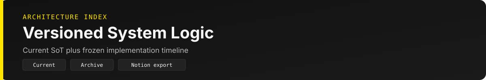
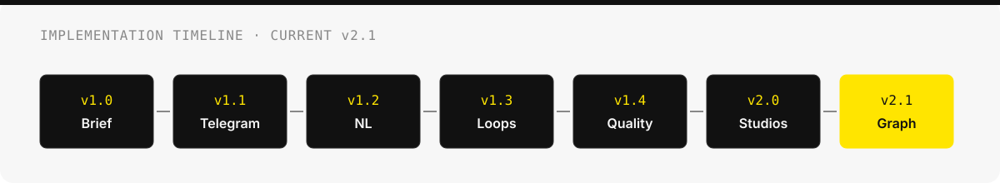

<p align="center">
  
</p>

# Architecture Docs

시스템 로직·다이어그램 SoT와 구현 단계별 버전 아카이브예요.

**현행만 편집합니다.** major/minor bump 시 상세는 `archive/v{X.Y}-*.md`에 동결하고, [`SYSTEM-LOGIC.md`](./SYSTEM-LOGIC.md)는 요약+다이어그램만 유지해요.

---

## 현행 (Current)

| 문서 | 버전 | 기간 | 설명 |
|------|------|------|------|
| [SYSTEM-LOGIC.md](./SYSTEM-LOGIC.md) | **v2.1** | 2026-07-20 ~ | Graph · Token · Playbook · Newsletter Gate A–D · 품질 기준선 2026-08-12 |

```bash
~/hermes-content-studio/scripts/generate-architecture-md.py
~/hermes-content-studio/scripts/export-architecture-notion.sh
```

산출: `content/logs/{date}_studio-resources-spec.md` · `{date}_studio-dependency-diagrams.md` · `{date}_cursor-agent-resources.md`

---

## 버전 타임라인

<p align="center">
  
</p>

| 버전 | 아카이브 | 커밋 시대 | 핵심 마일스톤 |
|------|----------|-----------|---------------|
| v1.0 | [archive/v1.0-daily-brief-baseline.md](./archive/v1.0-daily-brief-baseline.md) | 2026-06-07 | 결정적 M1 Top 7 · Harness v1.2 초기 |
| v1.1 | [archive/v1.1-harness-telegram.md](./archive/v1.1-harness-telegram.md) | 2026-06-08 | Telegram Commander · Notion M5 · Brief SoT |
| v1.2 | [archive/v1.2-newsletter-commander.md](./archive/v1.2-newsletter-commander.md) | 2026-06-08 | B2B Newsletter P0–P6 · hermes-agent CLI |
| v1.3 | [archive/v1.3-content-loops-agents.md](./archive/v1.3-content-loops-agents.md) | 2026-06-27 | Content Loops L1/L2 · Agent A–D · Wiki |
| v1.4 | [archive/v1.4-quality-stack.md](./archive/v1.4-quality-stack.md) | 2026-07-01 | Voice/Naturalness/Budget P4–P15 |
| v2.0 | [archive/v2.0-multi-studio-jarvis.md](./archive/v2.0-multi-studio-jarvis.md) | 2026-07-13 | 8 Studio · JARVIS · OAuth watch |
| **v2.1** | [archive/v2.1-graph-token-playbook.md](./archive/v2.1-graph-token-playbook.md) | 2026-07-20~26 | Wiki Graph · Token SLA · Ask graph-first · Playbook · M1 redesign P1 |

---

## 관련 문서

| 문서 | 역할 |
|------|------|
| [../README.md](../README.md) | Docs 허브 |
| [../superpowers/specs/2026-08-11-ai-agent-blog-threads-daily-report-design.md](../superpowers/specs/2026-08-11-ai-agent-blog-threads-daily-report-design.md) | Velog형 블로그 + Threads 설계 |
| [HERMES-CONVERSATIONAL-AGENT-MODEL.md](../HERMES-CONVERSATIONAL-AGENT-MODEL.md) | 대화형 Agent · CAR 매핑 |
| [content-loops.md](../content-loops.md) | L1/L2/L3 루프 cadence |
| [MULTI-STUDIO-ARCHITECTURE.md](../MULTI-STUDIO-ARCHITECTURE.md) | 8 Studio registry · upstream |
| [LLM-WIKI-INTEGRATION.md](../LLM-WIKI-INTEGRATION.md) | Wiki · Graph 이중 메모리 |
| [JARVIS.md](../../JARVIS.md) | 프로젝트 메모리 · OMM |
| [HARNESS.md](../../HARNESS.md) | 5-Subsystem · Voice/Budget · Playbook · Gate A–D |
| `.harness/progress.md` | 세션 진행 SoT (F1–F4 · quality retest) |
