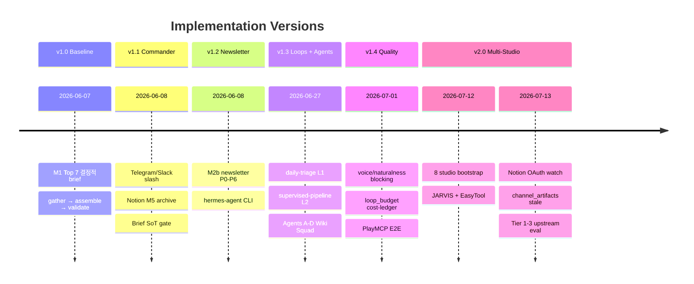
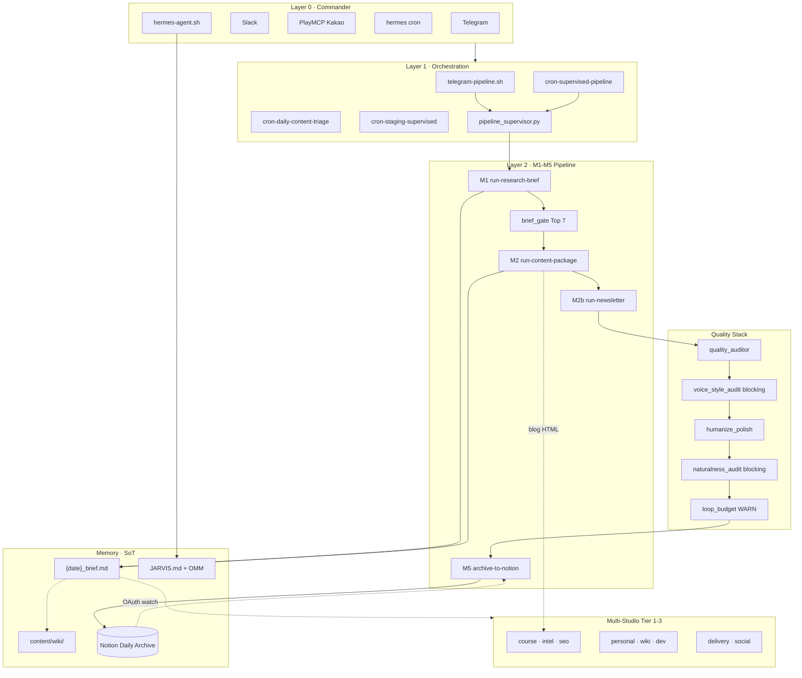
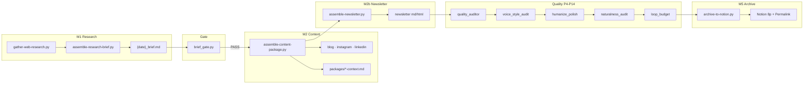
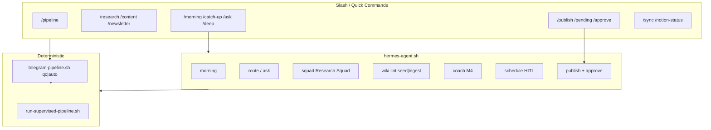
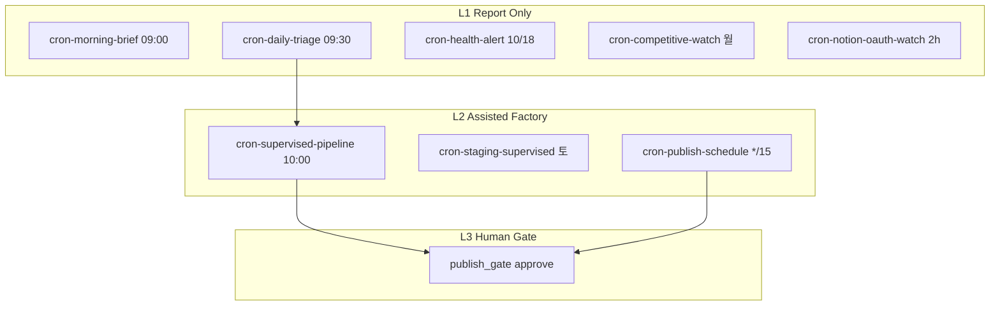
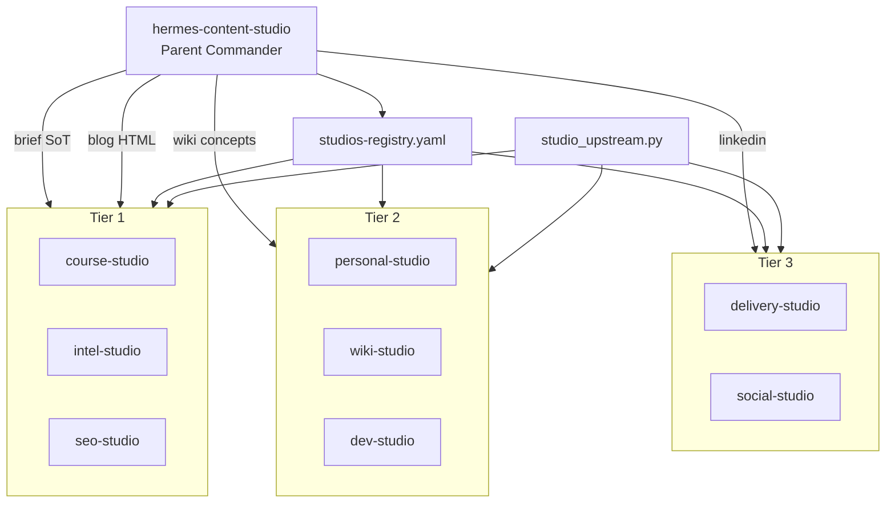
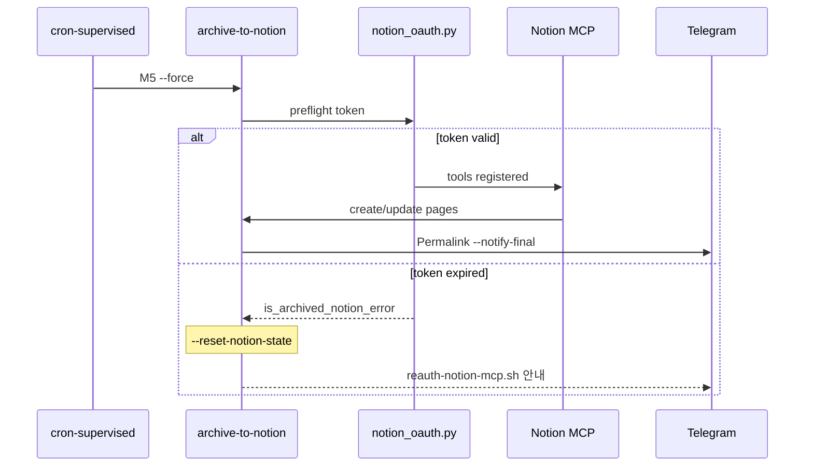

# Hermes Content Studio — System Logic (v2.0)

> **현행** · 2026-07-13 · Parent Commander + 8 sibling studios + JARVIS memory  
> 이전 버전: [archive/](./archive/)

---

## 0. 한 줄 정의

**Hermes Content Studio**는 Brief SoT(`{date}_brief.md`)를 중심으로 M1→M5 결정적 파이프라인을 돌리고, Telegram·Slack·PlayMCP·cron이 **Commander**로 감독·알림·HITL을 담당하며, 8개 sibling studio가 upstream 산출물을 소비하는 **자체호스팅 콘텐츠 공장**이다.

---

## 1. 버전 타임라인



---

## 2. 마스터 아키텍처 (v2.0)



---

## 3. 실행 모드 (결정적 vs 대화형)

| 축 | 결정적 | 대화형 |
|----|--------|--------|
| 목적 | 일일 콘텐츠·Notion 재현 | 심화 리서치·개인화·코딩 핸드오프 |
| 진입 | `run-pipeline.sh`, `/pipeline`, cron | `hermes-agent.sh`, `/ask`, `/deep`, `/automate` |
| 도구 | assemble-*.py, `-t hermes-cli` | skills + MCP + Codex(선택) |
| SLA | M1 ~20s · full ~70s | 가변 |
| 검증 | `validate-output.sh` 필수 | harness 가드레일 |

**통합 원칙:** 대화형이 트리거해도 M1→M5는 **동일 스크립트·동일 lib**을 탄다.

---

## 4. M1 → M5 + Quality Gate Chain



| Stage | 스크립트 | 산출 SoT | 차단 |
|-------|----------|----------|------|
| M1 | `run-research-brief.sh` | `_search_context_{date}.json`, `{date}_brief.md` | validate FAIL |
| GATE | `brief_gate.py` | Top 7 freshness | FAIL → M2 skip |
| M2 | `run-content-package.sh` | blog/instagram/linkedin, packages | validate FAIL |
| M2b | `run-newsletter.sh` | newsletter md/html/scores | newsletter-eval FAIL |
| AUDIT | `quality_auditor.py` | audit report | WARN only |
| VOICE | `voice_style_audit.py` | — | **blocking ON** |
| HUMANIZE | `run-humanize-polish.sh` | polished channels | WARN |
| NATURALNESS | `naturalness_audit.py` | — | **blocking ON** |
| BUDGET | `loop_budget.py` | cost-ledger | WARN (cap 초과) |
| M5 | `archive-to-notion.sh --force` | Notion pages | OAuth/MCP FAIL |

설정 SoT: `config/content-orchestration.yaml` · `config/content-quality.yaml`

---

## 5. Commander · hermes-agent Intent Map



| Intent | 진입 | 실행 |
|--------|------|------|
| pipeline | `/pipeline` | M1+M2+M2b+M5 (~70s) |
| morning | `/morning`, cron 09:00 | proactive + brief top3 |
| ask | `/ask`, `hermes-agent ask` | memory_router + brief graph |
| deep | `/deep` | research_squad Scout→Archivist |
| publish | `/publish` | HITL gate → approve |
| wiki | `hermes-agent wiki` | wiki_curator |
| coach | `/coach` | m4_coach CTOR feedback |

라우팅 SoT: `config/telegram-routing.yaml` · `config/slack-routing.yaml` · `config/agent-commands.yaml` · `config/commander-easytool.yaml`

---

## 6. Content Loops (L1 / L2 / L3)



상세: [content-loops.md](../content-loops.md)

---

## 7. Multi-Studio (8 siblings)



```bash
~/hermes-content-studio/scripts/bootstrap-hermes-studios.sh
~/hermes-content-studio/scripts/studios-all-upstream-eval.sh {date}
```

상세: [MULTI-STUDIO-ARCHITECTURE.md](../MULTI-STUDIO-ARCHITECTURE.md)

---

## 8. Notion M5 · OAuth Resilience



| 복구 | 스크립트 |
|------|----------|
| OAuth 재인증 | `reauth-notion-mcp.sh` |
| 날짜 백필 | `backfill-notion-archive.sh` |
| 지속 감시 | `cron-notion-oauth-watch.sh` |
| 중복 slug | `channel_artifacts.py` → `content/_stale/` |

---

## 9. JARVIS · EasyTool · OMM

| 컴포넌트 | 경로 | 역할 |
|----------|------|------|
| JARVIS | `JARVIS.md` | NOW/LAW/BAN/MAP 프로젝트 메모리 |
| OMM | `lib/omm.py` · `.harness/omm.jsonl` | 실수 → 방어선 기록 |
| EasyTool | `lib/easytool_prompt.py` | compact commander prompt (~893 chars) |
| JARVIS CODE | `jarvis-code-pilot.sh` | macOS 로컬 recall 파일럿 |

---

## 10. 리소스 계층 (Layer 0–7)

| Layer | 구성 | 대표 아티팩트 |
|-------|------|---------------|
| 0 | Commander | telegram/slack/playmcp routing yaml |
| 1 | Orchestration | supervised · triage · hermes-agent |
| 2 | Stage scripts | run-*-brief/package/newsletter/pipeline |
| 3 | Assemble | gather-*.py · assemble-*.py |
| 4 | Domain lib | brief_* · content_quality · notion_* · pipeline_supervisor |
| 5 | Config | config/*.yaml |
| 6 | Harness state | .harness/* · content/.notion-*-state.json |
| 7 | External | Notion MCP · ddgs · Codex · Telegram API |

---

## 11. 검증 기준선 (v2.0)

```bash
./scripts/init.sh --skip-health
./scripts/harness-eval.sh --quick                    # struct + wiring
./scripts/e2e-smoke-test.sh $(date +%Y-%m-%d) --telegram   # 23/23
./scripts/pipeline-integrity-eval.sh                 # 17/17
./scripts/studios-all-upstream-eval.sh $(date +%Y-%m-%d)
./scripts/jarvis-memory-eval.sh
HERMES_PLAYMCP_E2E_LIVE=1 ./scripts/playmcp-routing-e2e.sh
HERMES_M5_E2E_LIVE=1 ./scripts/m5-notion-eval.sh $(date +%Y-%m-%d)
./scripts/generate-architecture-md.py
```

---

## 12. 변경 시 워크플로

1. 구현 완료 → `validate-output.sh` · 해당 eval PASS
2. `.harness/progress.md` 갱신
3. **major 변경 시:** `SYSTEM-LOGIC.md` → `archive/v{X.Y}-*.md` 복사 후 현행 수정
4. `generate-architecture-md.py` 실행 → Notion `export-architecture-notion.sh`

---
*System Logic v2.0 · archived versions in [archive/](./archive/) · generated diagrams also in `content/logs/{date}_studio-dependency-diagrams.md`*
