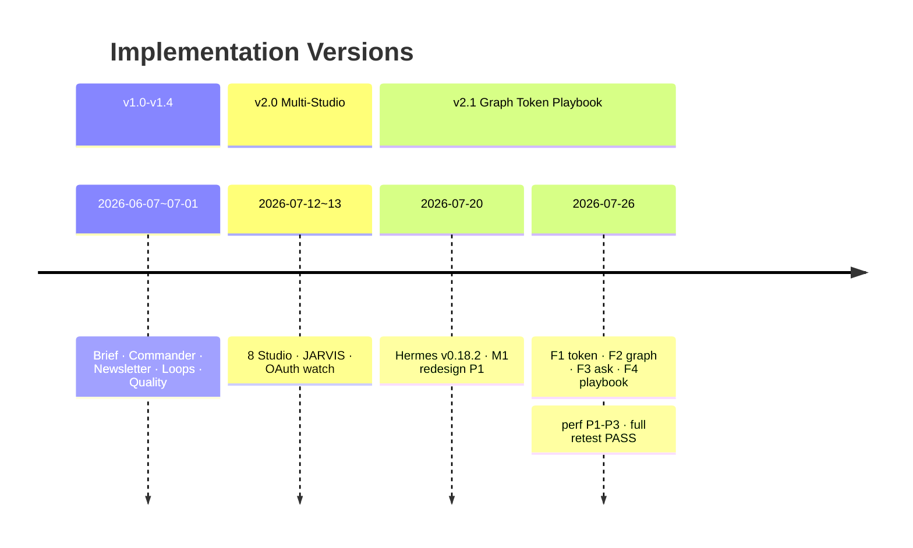
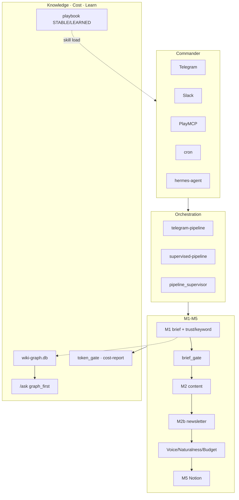
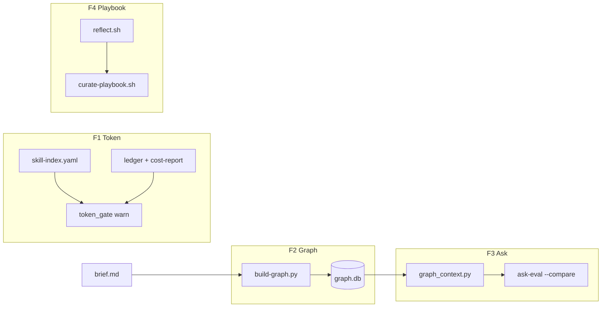
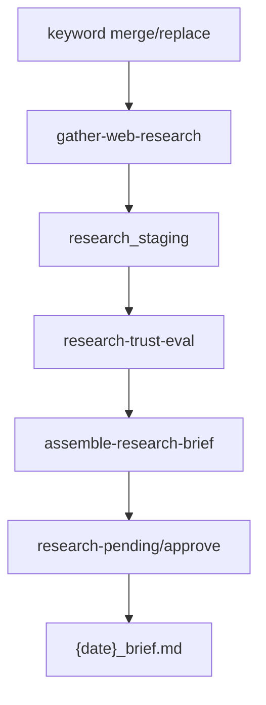

<p align="center">
  
</p>

# Hermes Content Studio — System Logic (v2.1)

> **현행** · 2026-07-26 · Graph · Token Gates · Playbook · M1 Redesign  
> 이전 버전: [archive/](./archive/) · 상세 변경: [archive/v2.1-graph-token-playbook.md](./archive/v2.1-graph-token-playbook.md) · [Docs 허브](../README.md)

---

## 0. 한 줄 정의

**Hermes Content Studio**는 Brief SoT(`{date}_brief.md`)를 중심으로 **결정적 M1→M5** 파이프라인을 돌리고, Telegram·Slack·PlayMCP·cron이 Commander로 감독하며, **Wiki Graph + 토큰 SLA + Playbook 학습 루프**로 질의·비용·스킬을 관리하는 자체호스팅 콘텐츠 공장이다.

| 증명 (2026-07-26) | 값 |
|-------------------|-----|
| full_pipeline | **24–29s** (SLA 60–70) |
| ask-eval | **−82~88%** tokens |
| Full Retest | quick 40/0 · record 31/0 · commander 28/0 |

```bash
./scripts/init.sh --skip-health
./scripts/harness-eval.sh --quick
```

---

## 1. 버전 타임라인

<p align="center">
  
</p>


```mermaid
timeline
  title Implementation Versions
  section v1.0-v1.4
    2026-06-07~07-01 : Brief · Commander · Newsletter · Loops · Quality
  section v2.0 Multi-Studio
    2026-07-12~13 : 8 Studio · JARVIS · OAuth watch
  section v2.1 Graph Token Playbook
    2026-07-20 : Hermes v0.18.2 · M1 redesign P1
    2026-07-26 : F1 token · F2 graph · F3 ask · F4 playbook
               : perf P1-P3 · full retest PASS
```

| 버전 | 핵심 |
|------|------|
| [v2.0](./archive/v2.0-multi-studio-jarvis.md) | Multi-Studio · JARVIS · Notion OAuth |
| **v2.1 (현행)** | Wiki Graph · Token gates · Ask graph-first · Playbook · M1 redesign |

---

## 2. 마스터 아키텍처 (v2.1)


```mermaid
flowchart TB
  subgraph L0["Commander"]
    TG["Telegram"] & SL["Slack"] & PM["PlayMCP"] & CRON["cron"] & CLI["hermes-agent"]
  end

  subgraph L1["Orchestration"]
    TP["telegram-pipeline"] & SP["supervised-pipeline"] & PSUP["pipeline_supervisor"]
  end

  subgraph L2["M1-M5"]
    M1["M1 brief + trust/keyword"] --> GATE["brief_gate"]
    GATE --> M2["M2 content"] --> M2b["M2b newsletter"]
    M2b --> Q["Voice/Naturalness/Budget"] --> M5["M5 Notion"]
  end

  subgraph G["Knowledge · Cost · Learn"]
    WG["wiki-graph.db"]
    ASK["/ask graph_first"]
    TGATE["token_gate · cost-report"]
    PB["playbook STABLE/LEARNED"]
  end

  L0 --> L1 --> L2
  M1 -.-> WG
  WG --> ASK
  L2 --> TGATE
  PB -.->|skill load| L0
```

---

## 3. F1–F4 지식·비용·학습 스택


```mermaid
flowchart LR
  subgraph F1["F1 Token"]
    IDX["skill-index.yaml"]
    LED["ledger + cost-report"]
    GATE1["token_gate warn"]
  end
  subgraph F2["F2 Graph"]
    BUILD["build-graph.py"]
    DB[("graph.db")]
  end
  subgraph F3["F3 Ask"]
    GC["graph_context.py"]
    EVAL["ask-eval --compare"]
  end
  subgraph F4["F4 Playbook"]
    REF["reflect.sh"]
    CUR["curate-playbook.sh"]
  end
  BRIEF["brief.md"] --> BUILD --> DB --> GC --> EVAL
  IDX --> GATE1
  LED --> GATE1
  REF --> CUR
```

| Feature | 상태 | 핵심 명령 |
|---------|------|-----------|
| **F1** token-budget-gates | ✅ passing | `cost-report.sh` · `token-gate-eval.sh` |
| **F2** wiki-graph-v1 | ✅ passing | `wiki-graph.sh` · `graph-query.sh stats` |
| **F3** ask-graph-context | ✅ passing | `ask-eval.sh --compare` (−87.9% tok) |
| **F4** playbook-loop | 🟡 infra · promote 수동 | `reflect.sh` · `curate-playbook.sh` |

설정 SoT: `config/harness.yaml` (v1.3.0) · `config/wiki.yaml` · `config/skill-index.yaml`

### 롤백 스위치

| Env | 효과 |
|-----|------|
| `HERMES_WIKI_GRAPH=0` | graph 빌드/소비 off |
| `HERMES_ASK_GRAPH=0` | /ask index_first만 |
| `HERMES_PLAYBOOK=stable` | LEARNED 비활성 |

---

## 4. M1 → M5 + Quality (유지)

| Stage | 스크립트 | 차단 |
|-------|----------|------|
| M1 | `run-research-brief.sh` (+ trust/keyword P1) | validate FAIL |
| GATE | `brief_gate.py` | FAIL → M2 skip |
| M2 | `run-content-package.sh` | validate FAIL |
| M2b | `run-newsletter.sh` | newsletter-eval |
| AUDIT→VOICE→HUMANIZE→NATURALNESS→BUDGET | quality stack | VOICE/NAT blocking ON |
| M5 | `archive-to-notion.sh --force` | OAuth/MCP FAIL |

상세 단계 다이어그램·Commander·Multi-Studio·Notion OAuth는 [v2.0 스냅샷](./archive/v2.0-multi-studio-jarvis.md)과 동일 골격. v2.1은 그 위에 Graph/Token/Playbook을 적층.

---

## 5. M1 Research Redesign (P1)


```mermaid
flowchart TB
  KW["keyword merge/replace"] --> GATHER["gather-web-research"]
  GATHER --> STAGE["research_staging"]
  STAGE --> TRUST["research-trust-eval"]
  TRUST --> ASSEMBLE["assemble-research-brief"]
  ASSEMBLE --> PENDING["research-pending/approve"]
  PENDING --> BRIEF["{date}_brief.md"]
```

| 항목 | 내용 |
|------|------|
| Plan | `docs/plans/2026-07-20-001-feat-m1-research-brief-redesign-plan.md` |
| 검증 | `research-trust-eval` 8/8 · `research-keyword-eval` 7/7 |
| Deferred | Evidence Pack P2 (`HERMES_EVIDENCE`) |

---

## 6. Content Loops · Multi-Studio · JARVIS

v2.0과 동일:

- L1 triage · L2 supervised · L3 HITL — [content-loops.md](../content-loops.md)
- 8 sibling studios — [MULTI-STUDIO-ARCHITECTURE.md](../MULTI-STUDIO-ARCHITECTURE.md)
- JARVIS.md · OMM · EasyTool — `JARVIS.md`

---

## 7. 성능 기준선 (2026-07-26)

| 항목 | 결과 |
|------|------|
| full_pipeline | **24–29s** (SLA 60–70) |
| research | ~17s (SLA 30) |
| content (eval, skip research) | **~2s** (baseline 3s) |
| wiki-graph 증분 | **~260ms** (SLA 3s) |
| ask-eval | **−82~88%** tokens |
| Full Retest | quick 40/0 · record 31/0 · commander 28/0 |

---

## 8. 검증 기준선 (v2.1)

```bash
./scripts/init.sh --skip-health
./scripts/harness-eval.sh --quick
./scripts/harness-eval.sh --record
./scripts/cost-report.sh --since 7d
./scripts/token-gate-eval.sh
./scripts/wiki-graph.sh --force --rebuild
./scripts/ask-eval.sh --compare
./scripts/reflect.sh --week --signals-only
./scripts/curate-playbook.sh --dry-run
./scripts/research-trust-eval.sh
./scripts/commander-integration-eval.sh
./scripts/generate-architecture-md.py
```

---

## 9. 문서 맵

| 문서 | 역할 |
|------|------|
| 본 파일 | 현행 System Logic |
| [archive/v2.1-…](./archive/v2.1-graph-token-playbook.md) | F1–F4 · M1 상세 변경 기록 |
| [LLM-WIKI-INTEGRATION.md](../LLM-WIKI-INTEGRATION.md) | Wiki + Graph 이중 메모리 |
| [HARNESS.md](../../HARNESS.md) | CAR · Voice/Budget · Playbook |
| `.harness/progress.md` | 세션 진행 SoT |

---
*System Logic v2.1 · 2026-07-26*
