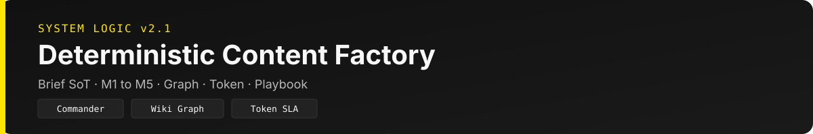
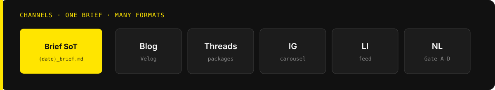
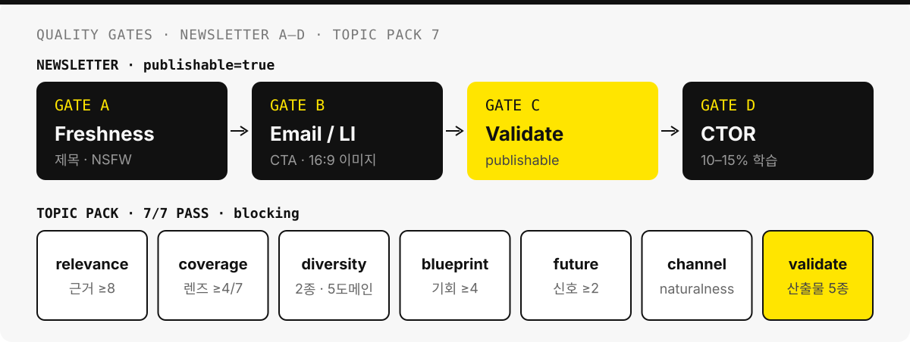
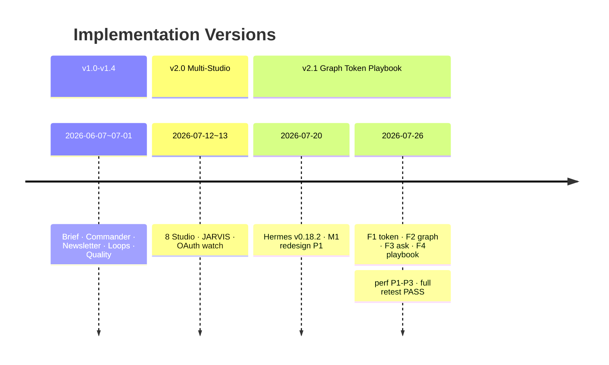
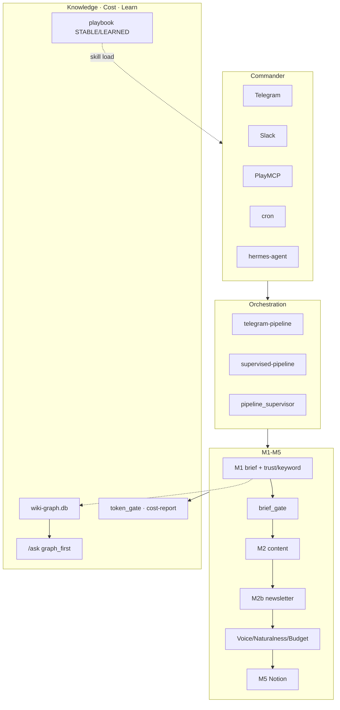
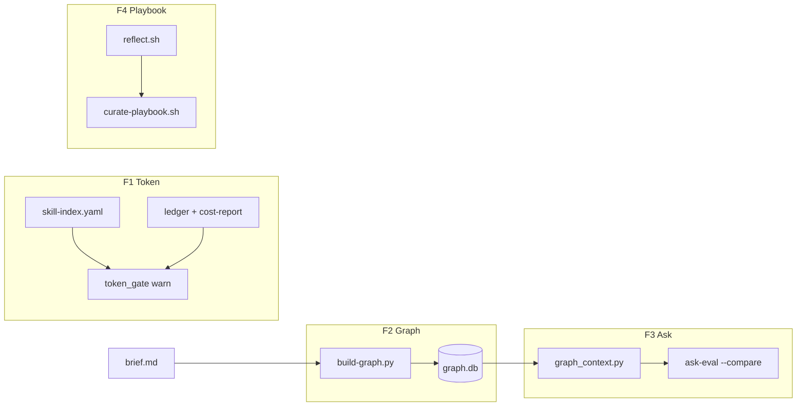
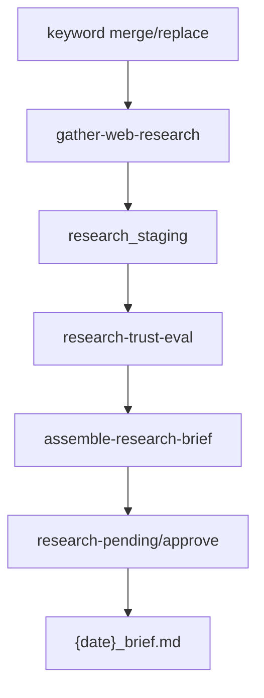
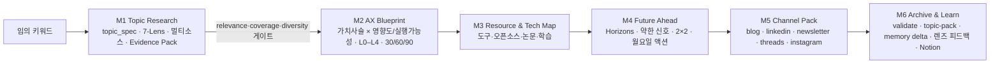

<p align="center">
  
</p>

# Hermes Content Studio — System Logic (v2.1)

> **현행** · 2026-08-12 · Graph · Token Gates · Playbook · M1 Redesign · Newsletter Gate A–D  
> 이전 버전: [archive/](./archive/) · 상세 변경: [archive/v2.1-graph-token-playbook.md](./archive/v2.1-graph-token-playbook.md) · [Docs 허브](../README.md)

---

## 0. 한 줄 정의

**Hermes Content Studio**는 Brief SoT(`{date}_brief.md`)를 중심으로 **결정적 M1→M5** 파이프라인을 돌리고, Telegram·Slack·PlayMCP·cron이 Commander로 감독하며, **Wiki Graph + 토큰 SLA + Playbook 학습 루프**로 질의·비용·스킬을 관리하는 자체호스팅 콘텐츠 공장이다.

| 증명 (2026-08-12 Full Quality) | 값 |
|--------------------------------|-----|
| full_pipeline | **20–26s** (SLA 60–70) |
| ask-eval | **−81~88%** tokens |
| harness-eval --quick | **40/0** |
| Newsletter Gate A–D | **PASS** · publishable=true |
| Full Quality Retest | agents 40/0 · e2e 19/0 · commander 28/0 |

<p align="center">
  
</p>

<p align="center">
  
</p>

```bash
./scripts/init.sh --skip-health
./scripts/harness-eval.sh --quick
./scripts/newsletter-gate-c-eval.sh
```
---

## 1. 버전 타임라인

<p align="center">
  
</p>


```mermaid
timeline
  title Implementation Versions
  section v1.0-v1.4
    2026-06-07~07-01 : Brief · Commander · Newsletter · Loops · Quality
  section v2.0 Multi-Studio
    2026-07-12~13 : 8 Studio · JARVIS · OAuth watch
  section v2.1 Graph Token Playbook
    2026-07-20 : Hermes v0.18.2 · M1 redesign P1
    2026-07-26 : F1 token · F2 graph · F3 ask · F4 playbook
               : perf P1-P3 · full retest PASS
```

| 버전 | 핵심 |
|------|------|
| [v2.0](./archive/v2.0-multi-studio-jarvis.md) | Multi-Studio · JARVIS · Notion OAuth |
| **v2.1 (현행)** | Wiki Graph · Token gates · Ask graph-first · Playbook · M1 redesign |
| v2.1 + Topic Pack (2026-10-02) | 임의 키워드 M1–M6 · AX Blueprint · Resource Map · Future Ahead (§5b) |

---

## 2. 마스터 아키텍처 (v2.1)


```mermaid
flowchart TB
  subgraph L0["Commander"]
    TG["Telegram"] & SL["Slack"] & PM["PlayMCP"] & CRON["cron"] & CLI["hermes-agent"]
  end

  subgraph L1["Orchestration"]
    TP["telegram-pipeline"] & SP["supervised-pipeline"] & PSUP["pipeline_supervisor"]
  end

  subgraph L2["M1-M5"]
    M1["M1 brief + trust/keyword"] --> GATE["brief_gate"]
    GATE --> M2["M2 content"] --> M2b["M2b newsletter"]
    M2b --> Q["Voice/Naturalness/Budget"] --> M5["M5 Notion"]
  end

  subgraph G["Knowledge · Cost · Learn"]
    WG["wiki-graph.db"]
    ASK["/ask graph_first"]
    TGATE["token_gate · cost-report"]
    PB["playbook STABLE/LEARNED"]
  end

  L0 --> L1 --> L2
  M1 -.-> WG
  WG --> ASK
  L2 --> TGATE
  PB -.->|skill load| L0
```

---

## 3. F1–F4 지식·비용·학습 스택


```mermaid
flowchart LR
  subgraph F1["F1 Token"]
    IDX["skill-index.yaml"]
    LED["ledger + cost-report"]
    GATE1["token_gate warn"]
  end
  subgraph F2["F2 Graph"]
    BUILD["build-graph.py"]
    DB[("graph.db")]
  end
  subgraph F3["F3 Ask"]
    GC["graph_context.py"]
    EVAL["ask-eval --compare"]
  end
  subgraph F4["F4 Playbook"]
    REF["reflect.sh"]
    CUR["curate-playbook.sh"]
  end
  BRIEF["brief.md"] --> BUILD --> DB --> GC --> EVAL
  IDX --> GATE1
  LED --> GATE1
  REF --> CUR
```

| Feature | 상태 | 핵심 명령 |
|---------|------|-----------|
| **F1** token-budget-gates | ✅ passing | `cost-report.sh` · `token-gate-eval.sh` |
| **F2** wiki-graph-v1 | ✅ passing | `wiki-graph.sh` · `graph-query.sh stats` |
| **F3** ask-graph-context | ✅ passing | `ask-eval.sh --compare` (−87.9% tok) |
| **F4** playbook-loop | 🟡 infra · promote 수동 | `reflect.sh` · `curate-playbook.sh` |

설정 SoT: `config/harness.yaml` (v1.3.0) · `config/wiki.yaml` · `config/skill-index.yaml`

### 롤백 스위치

| Env | 효과 |
|-----|------|
| `HERMES_WIKI_GRAPH=0` | graph 빌드/소비 off |
| `HERMES_ASK_GRAPH=0` | /ask index_first만 |
| `HERMES_PLAYBOOK=stable` | LEARNED 비활성 |

---

## 4. M1 → M5 + Quality (유지)

| Stage | 스크립트 | 차단 |
|-------|----------|------|
| M1 | `run-research-brief.sh` (+ trust/keyword P1) | validate FAIL |
| GATE | `brief_gate.py` | FAIL → M2 skip |
| M2 | `run-content-package.sh` (blog · threads · IG · LI) | validate FAIL |
| M2b | `run-newsletter.sh` | Gate A–D · `publishable=false` 시 Notion newsletter 스킵 |
| AUDIT→VOICE→HUMANIZE→NATURALNESS→BUDGET | quality stack | VOICE/NAT blocking ON |
| M5 | `archive-to-notion.sh --force` | OAuth/MCP FAIL |

### Newsletter Gate A–D (2026-07-27 · harden 2026-08-11/12)

| Gate | 범위 | eval |
|------|------|------|
| **A** | 신선도 · NSFW · 영문↔한글 제목 정합 | `newsletter-freshness-eval.sh` |
| **B** | Email/LI 길이 · HTTPS CTA · 16:9 이미지 프롬프트 | `newsletter-gate-b-eval.sh` |
| **C** | validate · `publishable` · fail-injection | `newsletter-gate-c-eval.sh` |
| **D** | CTOR 학습 · 시드 제외 · 패턴 가중치 | `newsletter-gate-d-eval.sh` |

품질 harden: stale 제목 폴백 금지 · hero near-dup densify · `content/packages/{date}_newsletter-publish.json`

상세 단계 다이어그램·Commander·Multi-Studio·Notion OAuth는 [v2.0 스냅샷](./archive/v2.0-multi-studio-jarvis.md)과 동일 골격. v2.1은 그 위에 Graph/Token/Playbook을 적층.

---

## 5. M1 Research Redesign (P1)


```mermaid
flowchart TB
  KW["keyword merge/replace"] --> GATHER["gather-web-research"]
  GATHER --> STAGE["research_staging"]
  STAGE --> TRUST["research-trust-eval"]
  TRUST --> ASSEMBLE["assemble-research-brief"]
  ASSEMBLE --> PENDING["research-pending/approve"]
  PENDING --> BRIEF["{date}_brief.md"]
```

| 항목 | 내용 |
|------|------|
| Plan | `docs/plans/2026-07-20-001-feat-m1-research-brief-redesign-plan.md` |
| 검증 | `research-trust-eval` 8/8 · `research-keyword-eval` 7/7 |
| Deferred | Evidence Pack P2 (`HERMES_EVIDENCE`) → §5b Topic Pack에서 구현 |

---

## 5b. Topic-Agnostic AX Pipeline — Topic Pack M1–M6 (2026-10-02)

일별 `{date}_brief.md` 파이프라인과 **병렬**로 도는 주제 모드예요. 임의 키워드 하나로 리서치 → AX 자동화 설계 → 기술 자원 → Future Ahead → 채널 초안 → 아카이브·학습까지 결정적으로 생성해요 (LLM 없음).


```mermaid
flowchart LR
  KW["임의 키워드"] --> M1["M1 Topic Research<br/>topic_spec · 7-Lens · 멀티소스 · Evidence Pack"]
  M1 -->|"relevance·coverage·diversity 게이트"| M2["M2 AX Blueprint<br/>가치사슬 × 영향도/실행가능성 · L0–L4 · 30/60/90"]
  M2 --> M3["M3 Resource & Tech Map<br/>도구·오픈소스·논문·학습"]
  M3 --> M4["M4 Future Ahead<br/>Horizons · 약한 신호 · 2×2 · 월요일 액션"]
  M4 --> M5["M5 Channel Pack<br/>blog · linkedin · newsletter · threads · instagram"]
  M5 --> M6["M6 Archive & Learn<br/>validate · topic-pack · memory delta · 렌즈 피드백 · Notion"]
```

| 단계 | 모듈 (`scripts/lib/ax/`) | 산출물 (`content/topics/{slug}/`) | 게이트 |
|------|--------------------------|-----------------------------------|--------|
| M1 | `topic_spec` · `lens_queries` · `sources` · `evidence` · `brief` | `topic_spec.json` · `*_evidence_*.json` · `*_research_*.md` | relevance ≥8 · coverage ≥4/7 · diversity ≥2종·5도메인 |
| M2 | `blueprint` | `*_ax-blueprint_*.md/json` | 단계 ≥4 · KPI/HITL/리스크 필수 |
| M3 | `resources` | `*_resource-map_*.md` | validate |
| M4 | `future` | `*_future-ahead_*.md` | 예측 ≥2 (각 신호 ≥2) · 액션 ≥3 |
| M5 | `channels` | `*_{blog,linkedin,newsletter,threads,instagram}_*.md` | `score_naturalness` |
| M6 | `memory` · `pipeline` | `*_topic-pack_*.md` · `*_gates_*.json` · `_index.json` | validate-output 5종 |

**설계 포인트**

- **Topic Framing:** 의도어(도입·전략·비교…)는 주제어에서 분리하고, 약어는 확장(CDP → customer data platform)해요. 약어 단독 매칭은 마케팅·도메인 문맥이 있을 때만 relevance로 인정해요 (예: 기후 공시 CDP 배제).
- **7-Lens:** 정의 · 시장/뉴스 · 기술/도구 · 사례 · 규제/리스크 · 한국 · 미래 신호. 쿼리 렌즈와 본문이 다르면 본문 기준으로 대표 렌즈를 재지정해요.
- **소스:** ddgs web/news (0건이면 `fallback_timelimit: y` 재시도) · GitHub Search · arXiv · HN Algolia. 소스별 오류는 격리돼요.
- **학습:** `memory.json` seen URL로 delta(🆕) 표시 · `.harness/topic-lens-feedback.json` 수율 낮은 렌즈는 다음 실행에서 쿼리 +1.
- **격리:** 일별 glob(`{date}_linkedin_*.md`)과 충돌하지 않게 `content/topics/` 하위에만 저장해요.

| 항목 | 내용 |
|------|------|
| Plan | `docs/plans/2026-10-02-001-feat-topic-agnostic-ax-m1-m6-plan.md` |
| 설정 SoT | `config/topic-research.yaml` |
| 실행 | `./scripts/run-topic-pack.sh "키워드" [--stages M1,M2] [--notion] [--json]` |
| Commander | `/topic <kw>` · `/research <kw> --pack` · "토픽 리서치", "AX 설계" (auto) |
| 검증 | `topic-pack-eval.sh` 21/0 · pytest `tests/test_ax_*.py` 44 |
| 라이브 실측 | 숏폼 커머스 8–13s · RAG 평가 9–19s · CDP 도입 13–17s — 전 게이트 PASS (SLA 90s) |

---

## 6. Content Loops · Multi-Studio · JARVIS

v2.0과 동일:

- L1 triage · L2 supervised · L3 HITL — [content-loops.md](../content-loops.md)
- 8 sibling studios — [MULTI-STUDIO-ARCHITECTURE.md](../MULTI-STUDIO-ARCHITECTURE.md)
- JARVIS.md · OMM · EasyTool — `JARVIS.md`

---

## 7. 성능·품질 기준선 (2026-08-12)

| 항목 | 결과 |
|------|------|
| full_pipeline | **20–26s** (SLA 60–70) |
| research | ~17–21s (SLA 30) |
| content (eval, skip research) | **~2–3s** (baseline 3s) |
| wiki-graph 증분 / rebuild | **~350ms / ~7s** (SLA 3s / 10s) |
| ask-eval | **−81~88%** tokens |
| harness-eval --quick | **40/0** |
| Newsletter Gate A–D | **PASS** · publishable=true |
| Full Quality Retest | agents 40/0 · e2e 19/0 · commander 28/0 · staging PASS |

이전 스냅샷 (2026-07-26): full 24–29s · quick 40/0 · ask −82~88% — 동일 SLA 밴드.

---

## 8. 검증 기준선 (v2.1)

```bash
./scripts/init.sh --skip-health
./scripts/harness-eval.sh --quick
./scripts/harness-eval.sh --record
./scripts/cost-report.sh --since 7d
./scripts/token-gate-eval.sh
./scripts/wiki-graph.sh --force --rebuild
./scripts/ask-eval.sh --compare
./scripts/reflect.sh --week --signals-only
./scripts/curate-playbook.sh --dry-run
./scripts/research-trust-eval.sh
./scripts/topic-pack-eval.sh
./scripts/commander-integration-eval.sh
./scripts/newsletter-freshness-eval.sh
./scripts/newsletter-gate-b-eval.sh
./scripts/newsletter-gate-c-eval.sh
./scripts/newsletter-gate-d-eval.sh
./scripts/e2e-smoke-test.sh
./scripts/agents-eval.sh
./scripts/generate-architecture-md.py
```

---

## 9. 문서 맵

| 문서 | 역할 |
|------|------|
| 본 파일 | 현행 System Logic |
| [archive/v2.1-…](./archive/v2.1-graph-token-playbook.md) | F1–F4 · M1 상세 변경 기록 |
| [LLM-WIKI-INTEGRATION.md](../LLM-WIKI-INTEGRATION.md) | Wiki + Graph 이중 메모리 |
| [AI Agent blog+Threads 설계](../superpowers/specs/2026-08-11-ai-agent-blog-threads-daily-report-design.md) | Velog형 블로그 · Threads 패키지 |
| [HARNESS.md](../../HARNESS.md) | CAR · Voice/Budget · Playbook |
| `.harness/progress.md` | 세션 진행 SoT |

---
*System Logic v2.1 · 품질 기준선 갱신 2026-08-12*
