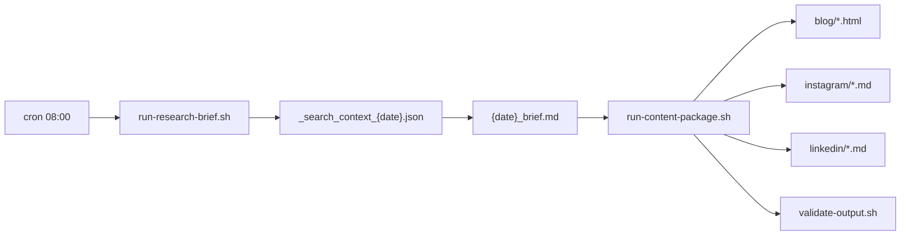

# Archive — v1.0 Daily Brief Baseline

> **동결** · 2026-06-07 · Initial commit `682db40`  
> 현행: [SYSTEM-LOGIC.md](../SYSTEM-LOGIC.md) v2.0

## 범위

- 결정적 M1 리서치 브리프 (Top 7)
- M2 콘텐츠 패키지 (blog · instagram · linkedin)
- Harness v1.2 5-Subsystem 초기
- `gather-web-research.py` → `assemble-research-brief.py` → `validate-output.sh`

## 아키텍처 (v1.0)



## Layer (당시)

| Layer | 구성 |
|-------|------|
| 2 | `run-research-brief.sh` · `run-content-package.sh` |
| 3 | `gather-web-research.py` · `assemble-research-brief.py` · `assemble-content-package.py` |
| 4 | `brief_quality.py` · `content_quality.py` |
| 5 | `config/research-brief.yaml` · `config/studio.yaml` |

## 없었던 것

- Telegram Commander / Notion M5 자동화
- Newsletter M2b
- hermes-agent · Content Loops
- Voice/Naturalness/Budget
- Multi-Studio · JARVIS

## 검증

```bash
./scripts/run-research-brief.sh
./scripts/run-content-package.sh
./scripts/validate-output.sh research content/research/{date}_brief.md
```
