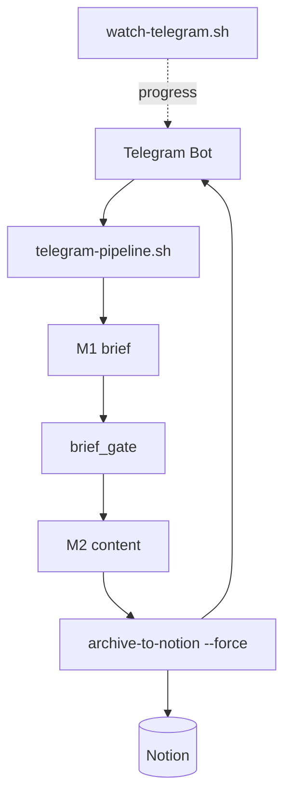

# Archive — v1.1 Harness + Telegram Commander

> **동결** · 2026-06-08 · Notion M5 · Brief SoT gate  
> 현행: [SYSTEM-LOGIC.md](../SYSTEM-LOGIC.md) v2.0

## 추가된 범위

- Telegram `/pipeline` · `telegram-pipeline.sh` 결정적 E2E
- Notion `archive-to-notion.sh --force` + Permalink
- `brief_gate.py` — M2 전 Top 7 SoT
- `watch-telegram.sh` 진행 알림
- Unified context · Notion templates

## 아키텍처 (v1.1)



## M1 → M5 (당시)

| Stage | 산출 |
|-------|------|
| M1 | `{date}_brief.md` |
| M2 | blog · instagram · linkedin · packages |
| M5 | Notion 5 pages + Permalink |

## 핵심 lib

`notion_templates.py` · `notify_format.py` · `brief_gate.py` · `telegram_sync_guard`

## 검증

```bash
./scripts/telegram-pipeline.sh qc pipeline
./scripts/e2e-smoke-test.sh --telegram
./scripts/archive-to-notion.sh {date} --force
```
