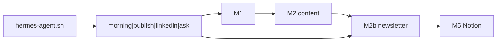

# Archive — v1.2 Newsletter + hermes-agent CLI

> **동결** · 2026-06-08 · B2B Newsletter P0–P6 · Commander phases  
> 현행: [SYSTEM-LOGIC.md](../SYSTEM-LOGIC.md) v2.0

## 추가된 범위

- **M2b** `run-newsletter.sh` — B2B 뉴스레터 md/html/subject-scores
- Newsletter P0–P6: subject scoring · HTML template · Notion paste · CTOR
- `hermes-agent.py` / `hermes-agent.sh` — intent 라우터 (morning · publish · linkedin)
- Commander Phases 1–4: cron morning/health · `/pending` · Slack 동등화
- LinkedIn M3 pipeline

## 아키텍처 (v1.2)



## Newsletter 산출

| 파일 | 역할 |
|------|------|
| `{date}_newsletter_*.md` | 본문 |
| `{date}_newsletter_*.html` | Stripo-style HTML |
| `{date}_newsletter_subject-scores.json` | A/B 제목 |
| `packages/{date}_newsletter-paste.md` | Notion 붙여넣기 팩 |

## Commander cron (당시)

- `cron-morning-brief` 평일 09:00
- `cron-health-alert` 10:00/18:00

## 검증

```bash
./scripts/run-newsletter.sh --validate
./scripts/newsletter-eval.sh
./scripts/commander-phases-eval.sh
./scripts/hermes-agent.sh morning
```
