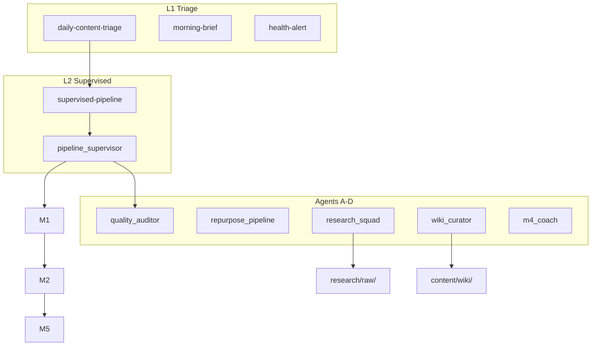

# Archive — v1.3 Content Loops + Agents A–D

> **동결** · 2026-06-27 · L1/L2 loops · Wiki · Research Squad  
> 현행: [SYSTEM-LOGIC.md](../SYSTEM-LOGIC.md) v2.0

## 추가된 범위

### Content Loops
- **L1** `cron-daily-content-triage` (09:30)
- **L2** `cron-supervised-pipeline` (10:00) · `pipeline_supervisor.py`
- `content-loop-runs.jsonl` run log

### Agent Roadmap A–D
| Phase | Agent |
|-------|-------|
| A | Instagram M3 · Auditor · Repurpose |
| B | HITL Scheduler · Pipeline Supervisor |
| C | Wiki Curator · Research Squad · Competitive Watch |
| D | M4 Performance Coach |

### Wiki 이중 메모리
- `content/wiki/concepts/` · `wiki_curator.py` · `wiki-seed.sh`

## 아키텍처 (v1.3)



## Longform (당시 추가)
- `longform_context.py` · blog H2×7 · newsletter 모듈 확장

## 검증

```bash
./scripts/content-ops-eval.sh
./scripts/content-knowledge-eval.sh
./scripts/agents-eval.sh
HERMES_CRON_SKIP_NOTION=1 ./scripts/cron-supervised-pipeline.sh
```

상세 루프: [content-loops.md](../../content-loops.md) (당시 버전 기준 갱신됨)
