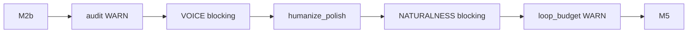

# Archive — v1.4 Quality Stack (P4–P15)

> **동결** · 2026-07-01 · Voice · Naturalness · Budget · PlayMCP  
> 현행: [SYSTEM-LOGIC.md](../SYSTEM-LOGIC.md) v2.0

## 추가된 범위

### 프로덕션 blocking (`config/content-quality.yaml`)
| 키 | 값 |
|----|-----|
| `voice_blocking` | true |
| `naturalness_blocking` | true |
| `budget_blocking` | false (WARN) |
| `daily_token_cap` | 600000 |

### Quality pipeline (supervised 내부)


### 신규 lib
- `hermes_cost.py` — Codex token/USD · session delta
- `loop_budget.py` — daily/path cap · kill switch
- `naturalness_audit.py` · `voice_style_audit.py` · `humanize_polish.py`
- `content_quality_config.py` — yaml SoT loader

### Staging
- `cron-staging-supervised` 토 11:00
- `HERMES_SUPERVISED_STAGING=1` blocking 프로필

### PlayMCP
- `playmcp-routing-e2e.sh` LIVE 7/7

## 검증 기준선 (당시)

```bash
./scripts/voice-style-eval.sh
./scripts/naturalness-eval.sh
./scripts/loop-budget-eval.sh
HERMES_HUMANIZE_LLM_LIVE=1 ./scripts/humanize-llm-eval.sh
HERMES_PLAYMCP_E2E_LIVE=1 ./scripts/playmcp-routing-e2e.sh
./scripts/staging-supervised-eval.sh
```

## 자동 아키텍처 MD
- `generate-architecture-md.py` → `content/logs/{date}_studio-*`
