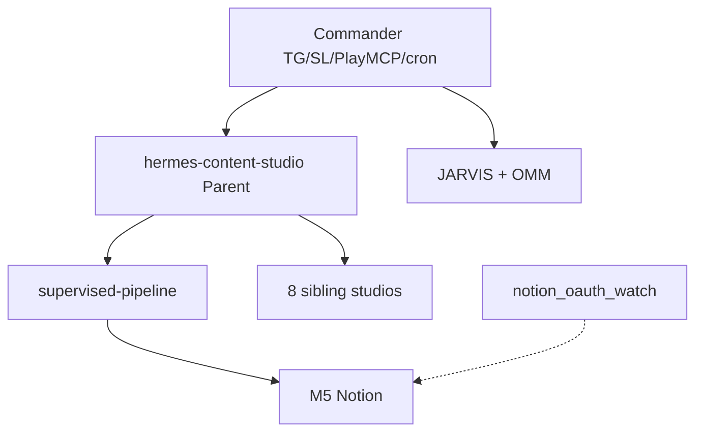

# Archive — v2.0 Multi-Studio + JARVIS (스냅샷)

> **동결** · 2026-07-13 · commit `dad71c0` 시점 스냅샷  
> **현행 문서와 동일 내용** — 이후 변경은 [SYSTEM-LOGIC.md](../SYSTEM-LOGIC.md)만 갱신

## v2.0 마일스톤

| 날짜 | 항목 |
|------|------|
| 2026-07-12 | 8 Studio bootstrap · `studios-registry.yaml` |
| 2026-07-12 | JARVIS.md · OMM · EasyTool commander |
| 2026-07-12 | Tier 1–3 upstream eval |
| 2026-07-09 | Notion OAuth 복구 · backfill · channel_artifacts |
| 2026-07-13 | `cron-notion-oauth-watch` · stale slug → `_stale/` |

## 마스터 다이어그램 (v2.0 스냅샷)



## 8 Studio

| Tier | Studios |
|------|---------|
| 1 | course · intel · seo |
| 2 | personal · wiki · dev |
| 3 | delivery · social |

## 검증 (v2.0 스냅샷)

```bash
./scripts/studios-all-upstream-eval.sh
./scripts/jarvis-memory-eval.sh
./scripts/pipeline-integrity-eval.sh
HERMES_M5_E2E_LIVE=1 ./scripts/m5-notion-eval.sh
```

> v2.0 이후 minor 업데이트는 `SYSTEM-LOGIC.md`에만 반영. major bump 시 이 파일을 새 스냅샷으로 교체.
