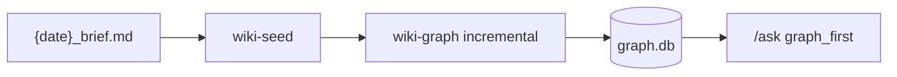
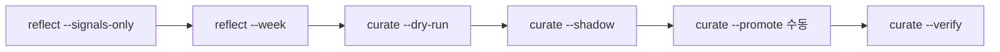

# Archive — v2.1 Graph · Token · Playbook · M1 Redesign

> **동결** · 2026-07-26 · commit `9967c8d` (+ M1 redesign on `feat/m1-research-brief-redesign`)  
> 현행: [SYSTEM-LOGIC.md](../SYSTEM-LOGIC.md) v2.1

---

## 한 줄 요약

일별 M1→M5 공장은 유지한 채, **Wiki Graph(결정적)** · **토큰 SLA 게이트** · **/ask graph-first** · **SKILL STABLE/LEARNED 학습 루프**를 얹고, M1에 **키워드·신뢰 게이트·스테이징**을 추가했다.

---

## 마일스톤 타임라인

| 날짜 | 항목 | 커밋/브랜치 |
|------|------|-------------|
| 2026-07-20 | Hermes Agent v0.15.1 → **v0.18.2** · config v33 | `6a67cbf` |
| 2026-07-20 | M1 Research Brief Redesign **P1** | `f81468e` · `ea61d48` |
| 2026-07-20 | research functional stress suite | `4d2c489` |
| 2026-07-26 | F1–F4 Graph/Token/Playbook | `9967c8d` |
| 2026-07-26 | 성능 후속 P1–P3 · Full System Retest **PASS** | progress SoT |

---

## F1 — Token Budget Gates

### 목적
단계별 **초(sec) SLA**와 병행해 **토큰 예산**을 관측·경고하고, 스킬 로딩을 3단계(progressive)로 줄인다.

### 아티팩트

| 경로 | 역할 |
|------|------|
| `config/harness.yaml` `sla.*` | tokens_in/out · deterministic 플래그 |
| `config/harness.yaml` `token_gate` | mode=warn · tolerance 15% · det strict |
| `config/skill-index.yaml` | Level 1 트리거 인덱스 (cap 400 tok) |
| `scripts/lib/token_budget.py` | 예산 검사 |
| `scripts/lib/ledger.py` | cost-ledger 집계 |
| `scripts/cost-report.sh` | `--since 7d` 리포트 |
| `scripts/token-gate-eval.sh` | 게이트 스모크 |
| `scripts/lib/skill_loader.py` | progressive load |
| `scripts/split-skill.py` | STABLE/LEARNED 분할 유틸 |

### 검증
```bash
./scripts/cost-report.sh --since 7d
./scripts/token-gate-eval.sh
./scripts/harness-eval.sh --quick   # token SLA wiring
```

### 결과 (2026-07-26)
- token gate **PASS** (결정적 경로 tokens=0)
- Level1 skill index 적용 · 16 skills 메타

---

## F2 — Wiki Graph v1

### 목적
`content/wiki/graph.db`에 **bi-temporal** 개념 그래프를 쌓는다. **LLM 0회**, 결정적 빌드.

### 아티팩트

| 경로 | 역할 |
|------|------|
| `schemas/graph.sql` | DDL |
| `config/wiki.yaml` `graph` | incremental SLA 3s · rebuild 10s |
| `scripts/lib/graph.py` | DB API |
| `scripts/build-graph.py` | extract · invalidate · rebuild/incr |
| `scripts/wiki-graph.sh` | CLI 래퍼 |
| `scripts/graph-query.sh` | stats · query |

### 파이프라인 위치


### 검증
```bash
./scripts/wiki-graph.sh --force --rebuild
./scripts/graph-query.sh stats
./scripts/wiki-lint-eval.sh
```

### 결과 (2026-07-26)
- graph.db ~605 nodes · rebuild ~6–7s · 증분 **~260ms** (후속 P1–P3)
- wiki-lint 13/0

### 롤백
`HERMES_WIKI_GRAPH=0`

---

## F3 — Ask Graph Context

### 목적
`/ask`가 브리프 전문을 로드하지 않고 **서브그래프 digest**만 조립 → 토큰 대폭 감소.

### 아티팩트

| 경로 | 역할 |
|------|------|
| `config/wiki.yaml` `ask` | mode=graph_first · budget 3000 · hops 2 |
| `scripts/lib/graph_context.py` | 서브그래프 조립 |
| `config/ask-eval-questions.yaml` | 평가 질문셋 |
| `scripts/ask-eval.sh` | `--compare` 토큰 비교 |
| `content/wiki/ask-eval-baseline.md` | 품질 baseline |

### 검증
```bash
./scripts/ask-eval.sh --compare
```

### 결과 (2026-07-26)
- ask-eval 토큰 **−87.9%** (후속 −82.2%, 시드 0건 4→0)
- fallback: index_first

### 롤백
`HERMES_ASK_GRAPH=0`

---

## F4 — Playbook Loop

### 목적
SKILL.md를 **STABLE(사람)** / **LEARNED(append-only)** 로 나누고, Reflector→Curator→shadow→promote 학습 루프를 둔다.

### 아티팩트

| 경로 | 역할 |
|------|------|
| `config/harness.yaml` `playbook` | mode=learned · promotion_gate |
| `schemas/delta.schema.json` | Reflector delta 스키마 |
| `scripts/lib/reflect.py` · `reflect.sh` | 신호·delta |
| `scripts/lib/curator.py` · `curate-playbook.sh` | dry-run/shadow/promote/verify |
| `scripts/lib/playbook.py` | STABLE/LEARNED 로더 |
| `.harness/playbook-log.jsonl` | 승격 이력 (gitignore) |
| `.harness/shadow/` | shadow 스냅샷 (gitignore) |
| `.harness/deltas/` | delta JSON (gitignore) |

### 루프


### 원칙
- LEARNED append-only + `⚠DEPRECATED` tombstone
- STABLE은 사람만 편집
- expected 없는 delta 무효
- promote 전 harness-eval · validate · token 증가 ≤15% · shadow 5회

### 상태
- **infra 완료** · promote는 수동 잔여
- 롤백: `HERMES_PLAYBOOK=stable`

---

## M1 Research Brief Redesign (P1)

### 추가
- channel_hooks · diversity
- `research-trust-eval` · keyword merge/replace
- research-pending/approve (≠ publish HITL)
- TG/Slack/PlayMCP routing 연동
- Evidence Pack P2 deferred (`HERMES_EVIDENCE`)

### 검증
```bash
./scripts/research-trust-eval.sh      # 8/8
./scripts/research-keyword-eval.sh    # 7/7
```

Plan: `docs/plans/2026-07-20-001-feat-m1-research-brief-redesign-plan.md`

---

## 성능 후속 P1–P3 · Full Retest

| 항목 | Before → After |
|------|----------------|
| content (eval) | 17s → **2s** (`HERMES_SKIP_RESEARCH` + baseline 3s) |
| wiki-graph 증분 | 4–5s → **~260ms** |
| ask 시드 0건 | 4/12 → **0/12** |
| full_pipeline | 35s → **24–29s** |

**Full System Retest PASS:** quick 40/0 · record 31/0 · commander 28/0 · humanize 12/0 · ask −82.3%

수정: `hermes_cost.py` sessions.json non-dict 방어

---

## Hermes Agent 런타임

| 항목 | After |
|------|-------|
| Hermes | **v0.18.2** |
| Config | **v33** |
| health-check | Hermes venv `markitdown` |

---

## 검증 기준선 (v2.1)

```bash
./scripts/harness-eval.sh --quick
./scripts/harness-eval.sh --record
./scripts/cost-report.sh --since 7d
./scripts/token-gate-eval.sh
./scripts/wiki-graph.sh --force --rebuild
./scripts/ask-eval.sh --compare
./scripts/reflect.sh --week --signals-only
./scripts/curate-playbook.sh --dry-run
./scripts/research-trust-eval.sh
./scripts/commander-integration-eval.sh
```
